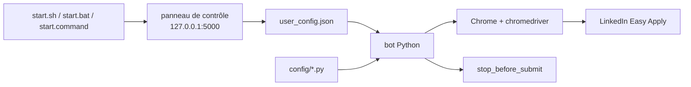

# GodsScion/Auto_job_applier_linkedIn

> Outil local qui automatise les candidatures LinkedIn depuis ton propre compte et ton propre poste.

## Le problème
Postuler à la chaîne sur LinkedIn veut dire remplir cent fois les mêmes champs Easy Apply.
Les outils existants exigent de confier identifiants et CV à un service tiers.

## Ce que ça fait vraiment
Tourne entièrement sur ta machine avec ton compte LinkedIn : trouve les offres pertinentes,
remplit les questions de candidature — avec aide d'une IA en option — et postule avec le CV fourni.
Le README annonce 100+ candidatures en moins d'une heure.
Panneau de contrôle web local (onglets Account, Profile, Search, Filters, Run settings) pour tout
configurer sans éditer de Python ; réglages enregistrés dans `user_config.json`.
L'édition manuelle de `config/*.py` reste possible : `personals.py`, `questions.py`, `search.py`,
`secrets.py`, `settings.py`.

## Comment c'est branché


## Essayer
```bash
./start.sh
```

## Coût et pièges
Gratuit ; il faut Python et Google Chrome installés. Les identifiants LinkedIn et l'éventuelle
configuration IA vivent dans des fichiers locaux (`secrets.py`), en clair.
Premier essai conseillé avec `stop_before_submit = True` pour voir ce que l'outil dirait
avant de le laisser envoyer. La fenêtre Chrome doit rester au premier plan pendant l'exécution.

## Ce que ce n'est pas
Ce n'est pas un service : rien n'est envoyé ailleurs, le panneau n'est joignable que depuis ta machine.
Ce n'est pas sans risque : le README renvoie explicitement au disclaimer, et rappelle que
la conformité aux conditions d'utilisation du site reste ta responsabilité — automatiser LinkedIn
n'est pas neutre pour ton compte. Aucune garantie d'aucune sorte.

## Alternatives
Aucune nommée dans le README.

## Pour toi
Sans intérêt technique pour toi, et le risque sur le compte LinkedIn n'en vaut pas la démonstration.
