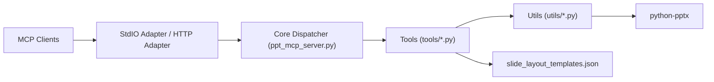

# GongRzhe/Office-PowerPoint-MCP-Server

> Serveur MCP Python pour créer et modifier des fichiers PowerPoint depuis un client IA.

## Le problème
Un agent ne sait pas produire ni éditer proprement un `.pptx` sans passer par du code sur mesure.

## Ce que ça fait vraiment
Expose 32 à 34 outils MCP (README incohérent sur le nombre) basés sur python-pptx : présentations, diapositives, texte, images (Pillow), formes, tableaux, graphiques, thèmes, hyperliens, connecteurs, transitions, extraction de texte. Fournit 25 modèles de diapositives et 4 palettes. Transport stdio ou HTTP ; Docker possible.

## Comment c'est branché


## Essayer
```bash
python setup_mcp.py
pip install -r requirements.txt
python ppt_mcp_server.py
python ppt_mcp_server.py --transport http --port 8000
docker build -t ppt_mcp_server .
```

## Coût et pièges
Gratuit, Python et pip. Le dépôt est archivé (lecture seule) : pas de correctifs à attendre. README annonce Python 3.6+ mais aucune vérification.

## Ce que ce n'est pas
Pas un générateur de decks « design » garanti : la mise en page reste celle de python-pptx et des modèles fournis. Le projet n'évolue plus.

## Alternatives
Aucune alternative nommée dans le README.

## Pour toi
À ignorer : archivé et à mainteneur unique ; pour du PowerPoint piloté par IA, mieux vaut utiliser python-pptx directement ou un serveur maintenu.
