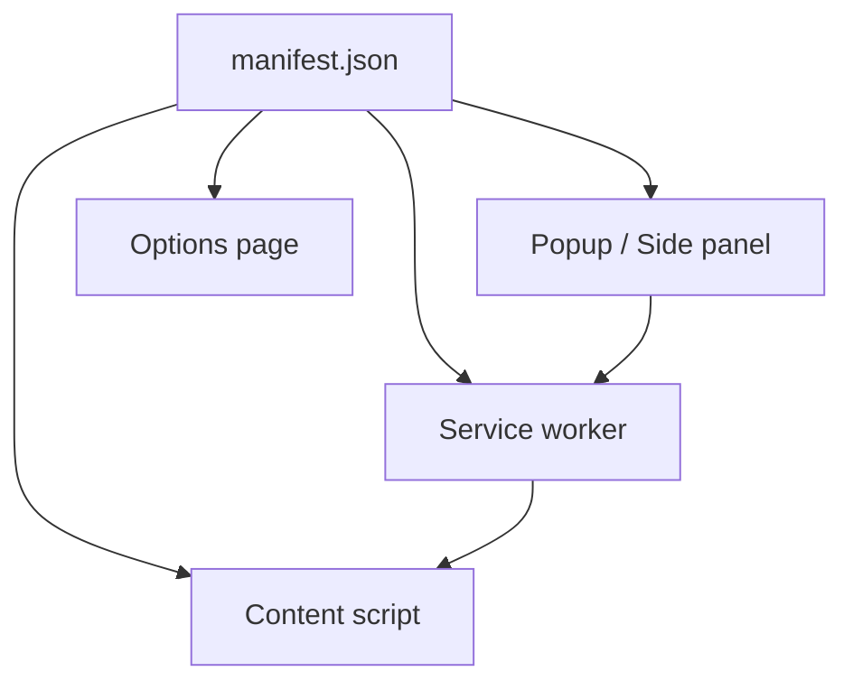

# GoogleChrome/chrome-extensions-samples

> Exemples officiels d'extensions Chrome, un par API ou par cas d'usage, pour développeurs d'extensions.

## Le problème
Les API d'extensions sont nombreuses et leur combinaison (service worker, scripts de contenu, popup) est difficile à deviner sans exemple.

## Ce que ça fait vraiment
Le dépôt regroupe des extensions autonomes : `api-samples/` (une API par exemple), `functional-samples/` (extensions complètes multi-API), `_archive/apps/` (applications Chrome dépréciées) et `_archive/mv2/` (manifest v2). Chaque exemple a son `manifest.json`, un service worker, éventuellement scripts de contenu, popup ou panneau latéral. Une page « Samples » permet de filtrer par API ou permission.

## Comment c'est branché


## Essayer
```bash
git clone <ce dépôt>
```
Puis « Load Unpacked Extension » depuis le navigateur (instruction du README, sans commande).

## Coût et pièges
Gratuit. Les exemples archivés (apps, manifest v2) sont dépréciés.

## Ce que ce n'est pas
Ce n'est pas une bibliothèque ni un modèle prêt à publier : chaque exemple illustre un point précis.

## Alternatives
Le README renvoie à la documentation Chrome Developers.

## Pour toi
À ignorer : utile seulement si tu écris une extension de navigateur, par exemple pour brancher un assistant IA sur des pages web.

