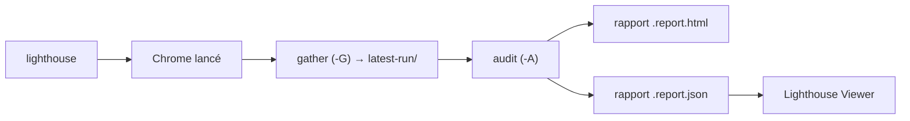

# GoogleChrome/lighthouse

> Audit automatisé d'une page web : performance, accessibilité, SEO, bonnes pratiques.

## Le problème
Mesurer la performance d'une page à la main donne des chiffres non reproductibles.
Sans budget mesuré en CI, les régressions arrivent en production sans être vues.

## Ce que ça fait vraiment
Lance Chrome, collecte des traces, exécute des audits et produit un rapport HTML, JSON ou CSV.
Trois surfaces : panneau DevTools, extension Chrome, CLI Node (la plus configurable).
Le cycle se découpe : `-G` collecte les artefacts sur disque, `-A` les rejoue en audits hors navigateur.
Émulation d'écran, throttling réseau/CPU, catégories et audits sélectionnables, plugins tiers.

## Comment c'est branché


## Essayer
```bash
npm install -g lighthouse
lighthouse https://airhorner.com/
lighthouse <url> --only-categories=performance,seo
lighthouse <url> --output json --output-path ./report.json --save-assets
lighthouse http://example.com -GA
```

## Coût et pièges
Gratuit, mais requiert Node 22+ et un Chrome installé ; les runs lourds génèrent de grosses traces.
Au premier lancement, le CLI demande l'autorisation d'envoyer anonymement les exceptions d'exécution.

## Ce que ce n'est pas
Ce n'est pas de la mesure terrain : c'est un test en laboratoire, avec sa variance documentée.
Ce n'est pas un moniteur : l'historique et les alertes viennent de services tiers (payants pour la plupart).
Le README fourni ici est tronqué au-delà de la section « related projects ».

## Alternatives
WebPageTest : mesure sur appareils réels, peut produire un rapport Lighthouse en complément.
GoogleChrome/lighthouse-ci : la version officielle pour suivre chaque commit et bloquer les régressions.
lighthouse-plugin-field-performance : ajoute les métriques utilisateurs réels du Chrome UX Report.

## Pour toi
Hors périmètre data/IA : utile seulement si tu livres une interface web dont la vitesse compte.
