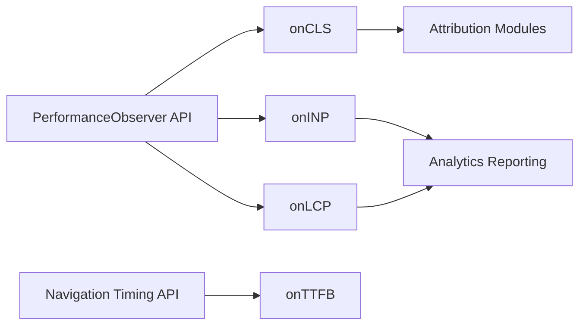

# GoogleChrome/web-vitals

> Petite bibliothèque JavaScript de Google qui mesure les Core Web Vitals sur de vrais utilisateurs.

## Le problème
Mesurer LCP, INP ou CLS côté navigateur exactement comme Chrome et les outils Google le font est délicat avec les API brutes.

## Ce que ça fait vraiment
Fonctions `onCLS`, `onINP`, `onLCP`, `onFCP`, `onTTFB` qui appellent un callback avec un objet `Metric` (valeur, delta, note, id, type de navigation). Build « attribution » pour savoir quel élément ou quel script cause une mauvaise valeur. Gère le back/forward cache, les pages en arrière-plan et, depuis Chrome 151, les navigations « soft » des SPA. Environ 3 Ko compressés.

## Comment c'est branché


## Essayer
```bash
npm install web-vitals
npm run build
npm test
```

## Coût et pièges
Gratuit. Certaines métriques ne remontent qu'après interaction ou changement d'onglet ; appeler les fonctions plusieurs fois augmente la mémoire.

## Ce que ce n'est pas
Pas un outil d'analytique : il mesure, à toi d'envoyer vers GA4 ou ton endpoint. Ne voit pas le contenu des iframes.

## Alternatives
- web-vitals-reporter : bibliothèque tierce pour regrouper les envois en une requête.

## Pour toi
À ignorer pour un profil data/IA : outil de performance web front-end, pertinent seulement si tu dois collecter des métriques utilisateur pour une analyse.
