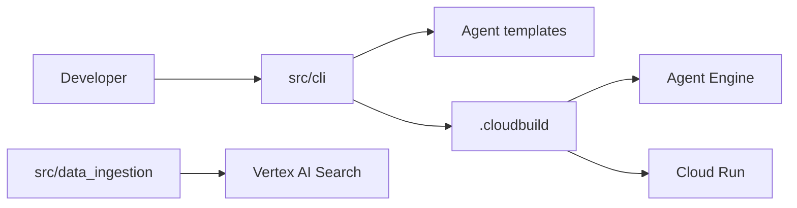

# GoogleCloudPlatform/agent-starter-pack

> Gabarits d'agents GenAI avec infra, CI/CD et observabilité sur Google Cloud, désormais en maintenance.

## Le problème
Passer d'un prototype d'agent à un déploiement avec Terraform, CI/CD et monitoring prend des semaines.

## Ce que ça fait vraiment
`agent-starter-pack create` génère un projet : agent (ADK, ADK A2A, RAG agentique, LangGraph, ADK Java, Live API), frontend, déploiement.
Cibles Cloud Run ou Agent Engine, Terraform, Cloud Build ou GitHub Actions.
Pipeline d'ingestion pour RAG (Vertex AI Search, Vector Search), évaluation Vertex AI.
`enhance` ajoute l'infra à un agent existant.

## Comment c'est branché


## Essayer
```bash
uvx agent-starter-pack create
pip install --upgrade agent-starter-pack
agent-starter-pack create
uvx agent-starter-pack enhance
uvx google-agents-cli setup
```

## Coût et pièges
Ressources GCP facturées sur ton projet ; Google Cloud SDK, Terraform, Make.
Projet en maintenance : correctifs critiques seulement.

## Ce que ce n'est pas
Pas un produit Google officiellement supporté (avertissement du README).
Pas le bon point de départ pour un nouveau projet : migrer vers `agents-cli`.

## Alternatives
- agents-cli : successeur recommandé par le README.
- ADK Samples : davantage d'exemples ADK.

## Pour toi
À ignorer au profit de `agents-cli` : le dépôt est gelé, utile seulement si tu as déjà des projets générés avec.
