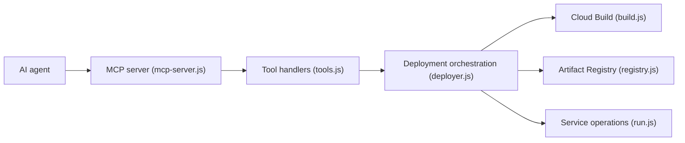

# GoogleCloudPlatform/cloud-run-mcp

> Serveur MCP et extension Gemini CLI qui permettent à un agent de déployer des applications sur Cloud Run.

## Le problème
Déployer du code sur Cloud Run depuis un agent IA exige de scripter gcloud à la main.

## Ce que ça fait vraiment
Sept outils MCP : déployer un contenu de fichiers, lister et lire des services, lire les journaux, et en local déployer un dossier, lister ou créer des projets GCP. Deux prompts (`deploy`, `logs`). Le code orchestre Cloud Build, Artifact Registry et Cloud Storage, avec un mode OAuth en option. Des « Cloud Run Skills » sur gcloud sont aussi fournis.

## Comment c'est branché


## Essayer
```bash
gcloud auth login
gcloud auth application-default login
gemini extensions install https://github.com/GoogleCloudPlatform/cloud-run-mcp
```
Configuration MCP : `"command": "npx", "args": ["-y", "@google-cloud/cloud-run-mcp"]`.

## Coût et pièges
Compte Google Cloud et identifiants applicatifs ; les déploiements et la création de projet (rattaché au premier compte de facturation) engagent votre facture. Le serveur distant ne doit jamais être exposé sans authentification IAM.

## Ce que ce n'est pas
Les conditions Google Cloud et le contrat de traitement des données ne s'appliquent à aucun composant du logiciel, selon le README. Pas une plateforme MLOps.

## Alternatives
Aucune alternative citée dans le README ; les « Cloud Run Skills » (dans le même dépôt) passent directement par gcloud.

## Pour toi
À surveiller si tu déploies sur Cloud Run : cela évite des scripts, mais donne à l'agent le droit de créer des projets et déploiements, donc à cadrer.
