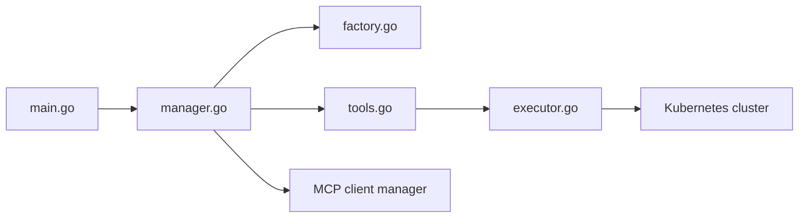

# GoogleCloudPlatform/kubectl-ai

> Agent CLI qui traduit des demandes en langage naturel en opérations kubectl.

## Le problème
Diagnostiquer un cluster demande de connaître par cœur kubectl et d'enchaîner les commandes à la main.

## Ce que ça fait vraiment
Une boucle agent : le LLM appelle les outils `kubectl` et `bash`, avec confirmation avant toute modification.
Gemini, Vertex, OpenAI, Azure, Grok, Bedrock, Ollama, llama.cpp via l'abstraction `gollm`.
Client MCP (outils externes) et serveur MCP (expose kubectl), en stdio ou HTTP avec OAuth optionnel.
Sessions persistantes, UI terminal ou web, outils personnalisés en YAML.

## Comment c'est branché


## Essayer
```bash
curl -sSL https://raw.githubusercontent.com/GoogleCloudPlatform/kubectl-ai/main/install.sh | bash
export GEMINI_API_KEY=your_api_key_here
kubectl-ai --quiet "fetch logs for nginx app in hello namespace"
```

## Coût et pièges
Clé LLM à ta charge, kubeconfig requis. En mode serveur MCP HTTP sans OAuth, n'importe qui qui atteint le port peut lancer kubectl et bash.

## Ce que ce n'est pas
Pas un produit Google officiellement supporté (dit en toutes lettres dans le README).

## Alternatives
Aucune alternative nommée dans le README.

## Pour toi
À surveiller : pratique pour déboguer les pods d'inférence sans maîtriser kubectl, à condition de garder la confirmation des actions activée.
