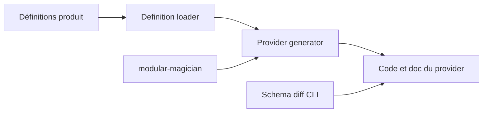

# GoogleCloudPlatform/magic-modules

> Générateur de code et CI qui produit les providers Terraform `google` et `google-beta`.

## Le problème
Maintenir à la main deux providers Terraform pour Google Cloud est coûteux et source d'écarts.

## Ce que ça fait vraiment
Une base de code unique pour développer les deux versions du provider. D'après le schéma : MMv1 charge des définitions produit/ressource, les valide et génère le code et la doc ; un convertisseur OpenAPI est expérimental. Outils annexes : diff de schéma, vérification de templates, changelog, étiquetage d'issues, configuration TeamCity. Le robot `modular-magician` gère génération et tests.

## Comment c'est branché

## Essayer
Aucune commande dans ce README ; renvoi à la documentation de contribution.

## Coût et pièges
README très court (matière insuffisante). La licence est présente mais non identifiée par GitHub : à vérifier. 482 issues ouvertes.

## Ce que ce n'est pas
Pas un outil pour utiliser le provider : il sert aux contributeurs de Google Cloud pour le générer.

## Alternatives
Le README ne cite aucune alternative.

## Pour toi
À ignorer : outillage interne de génération du provider, utile seulement si tu contribues au code du provider Google.
