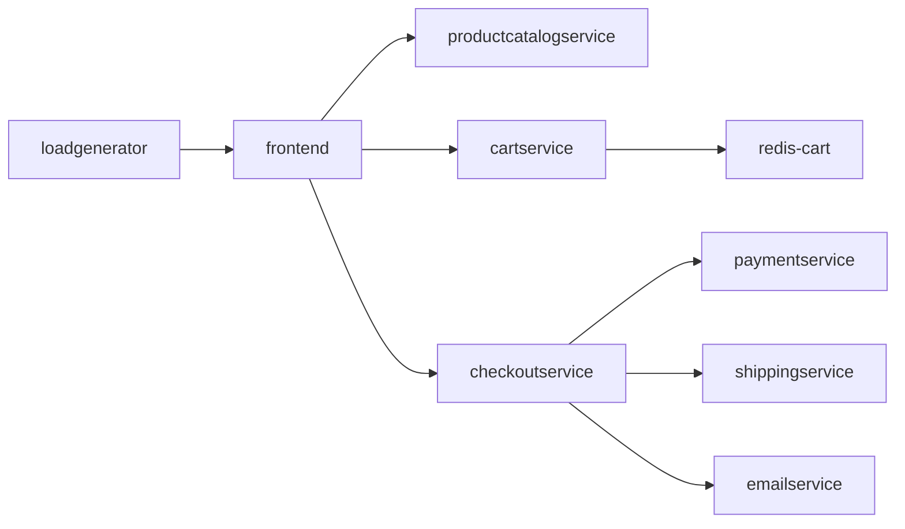

# GoogleCloudPlatform/microservices-demo

> Boutique en ligne factice en 11 microservices, faite pour démontrer des déploiements Kubernetes.

## Le problème
Tester un maillage de services, une chaîne de traces ou une politique réseau demande une application réaliste.
Fabriquer cette application soi-même prend plus de temps que l'expérience qu'on voulait mener.

## Ce que ça fait vraiment
Onze services écrits en Go, C#, Node.js, Python et Java, qui se parlent en gRPC.
Un `loadgenerator` Python/Locust envoie en continu du trafic imitant des parcours d'achat.
Les manifests Kubernetes prêts à appliquer sont dans `./release/kubernetes-manifests.yaml`.
Les descriptions Protocol Buffers sont dans `./protos` ; des variantes Kustomize couvrent Istio, Spanner, Memorystore.

## Comment c'est branché


## Essayer
```bash
git clone --depth 1 --branch v0 https://github.com/GoogleCloudPlatform/microservices-demo.git
cd microservices-demo/
export PROJECT_ID=<PROJECT_ID>
export REGION=us-central1
gcloud services enable container.googleapis.com --project=${PROJECT_ID}
gcloud container clusters create-auto online-boutique --project=${PROJECT_ID} --region=${REGION}
kubectl apply -f ./release/kubernetes-manifests.yaml
kubectl get pods
```

## Coût et pièges
Le quickstart crée un cluster GKE Autopilot facturé tant qu'il tourne : le README finit par la commande
de suppression, ce n'est pas décoratif. Il faut un projet Google Cloud, `gcloud`, `git` et `kubectl`.

## Ce que ce n'est pas
Pas une boutique : le paiement, l'expédition et l'e-mail sont explicitement simulés.
Pas réservé à GKE — le guide Development couvre Minikube et Kind — mais le chemin documenté est Google Cloud.
Pas un socle applicatif à reprendre : c'est une démonstration, pas une base de code métier.

## Alternatives
Aucune nommée dans le README.

## Pour toi
Un banc d'essai crédible pour tester tracing, service mesh ou autoscaling avant de toucher à ta prod.
