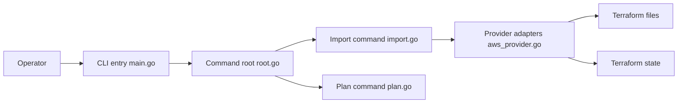

# GoogleCloudPlatform/terraformer

> CLI qui génère fichiers Terraform et tfstate depuis une infrastructure cloud existante.

## Le problème
Une infra créée à la main ne peut pas passer sous Terraform sans réécrire toutes les ressources.

## Ce que ça fait vraiment
« Terraform inversé » : liste les ressources d'un fournisseur (GCP, AWS, Azure, Kubernetes, GitHub, Datadog…), récupère leurs attributs via les providers Terraform.
Écrit `.tf`/`.json` et `tfstate`, relie les ressources par `terraform_remote_state`, état distant possible sur GCS.
Filtres par ID, type, tags ; commande `plan` pour relire avant import.

## Comment c'est branché


## Essayer
```bash
brew install terraformer
terraformer import aws --resources=vpc,subnet --filter=vpc=myvpcid --regions=eu-west-1
terraformer plan google --resources=networks,firewall --projects=my-project --regions=europe-west1-d
```

## Coût et pièges
Gratuit ; requiert Terraform et les plugins providers, plus des droits en lecture sur le cloud.

## Ce que ce n'est pas
Archivé le 16 mars 2026 : plus de correctifs de sécurité. Pas un produit Google officiel.

## Alternatives
- terraforming : AWS seulement, gabarits fragiles selon le README ; ne le préférer que pour de l'historique.

## Pour toi
À ignorer : archivé et sans maintenance, à n'utiliser que pour un import ponctuel en connaissance de cause.
