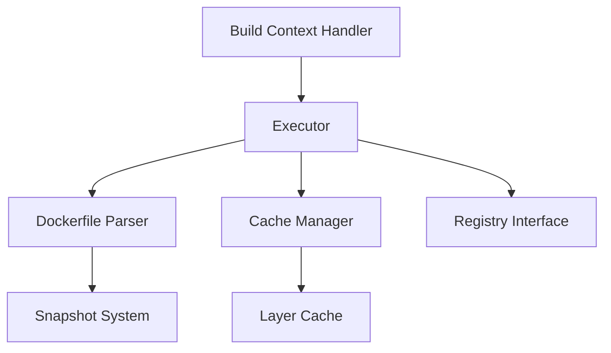

# GoogleContainerTools/kaniko

> Construit des images de conteneur depuis un Dockerfile dans Kubernetes, sans démon Docker. Il est archivé.

## Le problème
Construire des images dans un pod CI sans accès au démon Docker ni conteneur privilégié.

## Ce que ça fait vraiment
L'image executor extrait le système de fichiers de l'image de base, exécute chaque commande du Dockerfile, puis prend un instantané en espace utilisateur.
Le contexte de build peut venir de GCS, S3, Azure Blob, Git, d'un tar ou de stdin.
Il met en cache les couches RUN et COPY dans un registre, et le warmer met en cache les images de base.
Il pousse vers GCR, ECR, ACR, Docker Hub et JFrog.

## Comment c'est branché


## Essayer
```shell
tar -C <path to build context> -zcvf context.tar.gz .
kubectl create secret generic kaniko-secret --from-file=<path to kaniko-secret.json>
./run_in_docker.sh <path to Dockerfile> <path to build context> <destination of final image>
docker run -it --entrypoint=/busybox/sh gcr.io/kaniko-project/executor:debug
```

## Coût et pièges
Il est gratuit mais archivé depuis 2025-06 : plus aucun correctif de sécurité. Il ne rend pas sûrs les builds non fiables.

## Ce que ce n'est pas
Ce n'est plus un projet maintenu. Il ne construit pas de conteneurs Windows ni de manifestes multi-architectures.

## Alternatives
- BuildKit / img : sans root, mais seccomp et AppArmor doivent être désactivés.
- buildah : construction OCI sans root, sans démon.
- umoci, orca-build, FTL, Bazel rules_docker : approches plus bas niveau ou spécialisées.

## Pour toi
À ignorer : il est archivé. Pour construire tes images ML en CI, pars sur BuildKit ou buildah.
