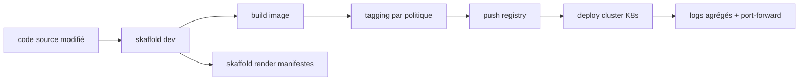

# GoogleContainerTools/skaffold

> Boucle de développement continue pour applications Kubernetes, sans composant côté cluster.

## Le problème
Modifier une ligne de code et la voir tourner dans un cluster suppose de rejouer à
la main build, push, tag et redéploiement à chaque itération.

## Ce que ça fait vraiment
Détecte les changements dans les sources et enchaîne automatiquement build, push et
déploiement, avec un tagging d'image piloté par politique. Agrège les logs des
ressources déployées et fait du port-forward vers la machine locale. `skaffold init`
découvre les fichiers du projet et génère la configuration. Les profils, la config
utilisateur, les variables d'environnement et les drapeaux décrivent les différences
entre environnements. `skaffold run` couvre le bout en bout, ou l'on compose son
propre pipeline phase par phase ; `skaffold render` sort des manifestes Kubernetes
hydratés utilisables en GitOps. Architecture enfichable pour brancher n'importe quel
outil de build ou de déploiement, applications multi-composants supportées.

## Comment c'est branché

## Essayer
Aucune commande d'installation dans le README : il renvoie à la page « Install
Skaffold » et aux GitHub Releases.

## Coût et pièges
Gratuit. Il faut un cluster Kubernetes, local ou distant, et un registre d'images.
Aucun composant installé côté cluster, donc rien à maintenir de ce côté.

## Ce que ce n'est pas
Pas un serveur CI ni un outil de déploiement de production à lui seul : il fournit
des briques pour en construire un. Pas de gestion de release ni de rollback décrite.
Le README emploie un vocabulaire promotionnel qu'on ne reprend pas ici.

## Alternatives
- Cloud Code (VS Code, JetBrains) : la même chose en extension gérée, par Google.

## Pour toi
Utile si tu itères sur un service ML packagé en conteneur sur Kubernetes ; sans
cluster, sans objet.
