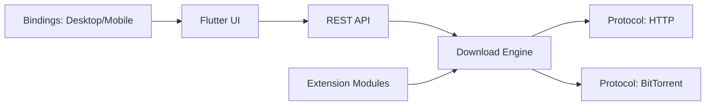

# GopeedLab/gopeed

> Gestionnaire de téléchargements Go et Flutter : HTTP, BitTorrent, magnet et ed2k, sur bureau, mobile et web.

## Le problème
Télécharger des fichiers volumineux ou des torrents avec reprise, gestion de tâches et automatisation demande souvent plusieurs applications.

## Ce que ça fait vraiment
Un noyau Go gère le moteur de téléchargement, les protocoles HTTP et BitTorrent, l'API REST et les extensions JavaScript. L'interface Flutter dialogue avec lui par HTTP (socket Unix, ou TCP sous Windows) ; en 2.0 bêta, par FFI. Il offre un CLI, une interface web, des webhooks, une extension navigateur et un point d'accès MCP qui permet à un agent IA de créer et suivre des téléchargements.

## Comment c'est branché


## Essayer
```bash
go install github.com/GopeedLab/gopeed/cmd/gopeed@latest
git clone git@github.com:GopeedLab/gopeed.git
```

## Coût et pièges
Gratuit. Compilation depuis les sources : Go 1.25+, Flutter 3.41+ et une chaîne C. La version 2.0 est en bêta, avec des fonctions possiblement instables. GPL-3.0.

## Ce que ce n'est pas
Ce n'est pas un client de médias : il télécharge. Le point MCP donne à un agent un pouvoir d'action sur le disque et le réseau, à restreindre.

## Alternatives
- Aucune alternative nommée dans le README.

## Pour toi
Surveiller : pratique pour récupérer de gros jeux de données ou modèles, et l'API MCP est un exemple d'outil pour agents.

