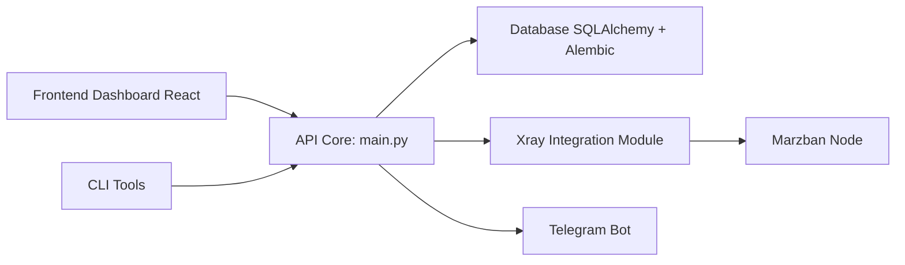

# Gozargah/Marzban

> Panneau web de gestion de comptes proxy anti-censure basé sur Xray-core.

## Le problème
Gérer des centaines d'utilisateurs de proxy Xray (quotas, expirations, liens) à la main dans des fichiers JSON.

## Ce que ça fait vraiment
Un backend REST Python (FastAPI, SQLAlchemy, Alembic) et un dashboard React.
Protocoles Vmess, VLESS, Trojan, Shadowsocks ; TLS et REALITY ; plusieurs nœuds.
Limites de trafic et d'expiration, liens d'abonnement compatibles V2ray et Clash, QR codes.
Bot Telegram, CLI, webhooks, sauvegardes envoyées sur Telegram.

## Comment c'est branché


## Essayer
```bash
sudo bash -c "$(curl -sL https://github.com/Gozargah/Marzban-scripts/raw/master/marzban.sh)" @ install
marzban cli admin create --sudo
```

## Coût et pièges
Gratuit ; il faut un domaine et un certificat SSL pour accéder au dashboard. Le script d'installation est exécuté en root via curl.

## Ce que ce n'est pas
Pas un VPN clé en main pour un poste : c'est un outil d'administration serveur.

## Alternatives
Aucune alternative nommée dans le README.

## Pour toi
À ignorer : c'est de l'administration de proxies, sans aucun lien avec la data ou l'IA.
