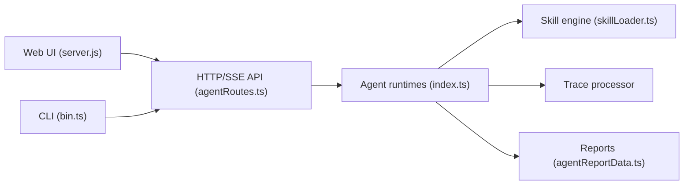

# Gracker/SmartPerfetto

> Couche d'analyse par IA sur les traces Perfetto Android : jank, démarrage, ANR, mémoire.

## Le problème
Lire une trace Perfetto exige d'écrire du SQL et de connaître les mécanismes internes d'Android.

## Ce que ça fait vraiment
On charge une trace, on pose une question en langage naturel, et l'outil exécute des compétences YAML déterministes et des requêtes SQL, puis rend une conclusion avec preuves vérifiées par le serveur. Interface web, CLI `smp`, API HTTP/SSE. Option d'analyse de code source local dont des extraits partent vers le fournisseur d'IA.

## Comment c'est branché


## Essayer
```bash
docker compose -f docker-compose.hub.yml up -d
./start.sh
npm install -g @gracker/smartperfetto
smp doctor
smp run trace.pftrace "Analyze scrolling jank"
```

## Coût et pièges
Un fournisseur d'IA doit être configuré (clé à ta charge). Node.js 24 LTS pour la source. Licence présente mais non identifiée par GitHub.

## Ce que ce n'est pas
Pas un outil généraliste de profilage ; les API publiques peuvent changer. Les conclusions restent à vérifier sur les preuves exposées.

## Alternatives
Perfetto Skills (analyse par agent) et TraceFix, Perfetto Tools de la même famille.

## Pour toi
À ignorer, sauf si tu analyses des performances Android : bon exemple d'IA appuyée sur des preuves, mais domaine très étroit.

