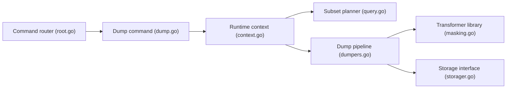

# GreenmaskIO/greenmask

> Utilitaire de dump logique PostgreSQL avec anonymisation, sous-ensembles et données synthétiques, pour équipes data et dev.

## Le problème
Copier une base de production vers staging ou dev expose des données personnelles et pèse trop lourd.

## Ce que ça fait vraiment
Sert de proxy autour du dump logique : sélectionne les objets, extrait éventuellement un sous-ensemble cohérent (références cycliques incluses), applique des transformations pendant le dump (masquage déterministe par hash, paramètres dynamiques, conditions), stocke le résultat (dossier, S3, Azure, SFTP) et restaure. Dumps compatibles `pg_restore`. MySQL annoncé « en cours ».

## Comment c'est branché


## Essayer
```bash
git clone git@github.com:GreenmaskIO/greenmask.git && cd greenmask
docker-compose run greenmask
```

## Coût et pièges
Gratuit, un binaire. Le bac à sable demande Docker. Les règles d'anonymisation sont à écrire et à valider toi-même.

## Ce que ce n'est pas
Pas une garantie de conformité : la qualité de l'anonymisation dépend de tes transformations. MySQL n'est pas terminé.

## Alternatives
- pg_dump / pg_restore et mysqldump : outils standard que Greenmask remplace en ajoutant les transformations.

## Pour toi
À adopter : répond à un besoin concret de données de test anonymisées et compatibles avec les outils PostgreSQL existants.
