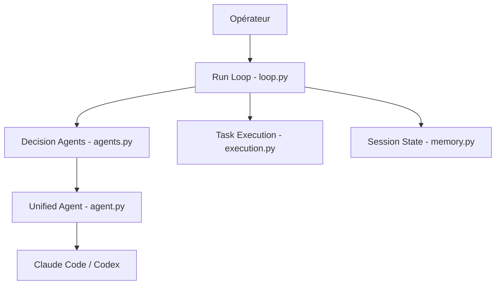

# GreyDGL/PentestGPT

> Agent en ligne de commande qui pilote Claude Code ou Codex pour mener des tests d'intrusion autorisés et des CTF.

## Le problème
Un test d'intrusion ou un CTF enchaîne reconnaissance, analyse et compte rendu, avec beaucoup de gestes répétitifs. Sans outillage, tout repose sur l'opérateur.

## Ce que ça fait vraiment
Deux modes. Un pipeline autonome par étapes (CTF : recon → exploit → walkthrough ; pentest : découverte d'actifs → vulnérabilités → rapport) qui délègue à Claude Code ou Codex, avec sauvegarde et reprise de session. Un mode interactif hérité, `pentestgpt-legacy`, avec trois sessions LLM (raisonnement, génération, analyse) et un arbre de tâches ; il accepte plusieurs fournisseurs, dont Ollama en local.

## Comment c'est branché


## Essayer
```bash
git clone https://github.com/GreyDGL/PentestGPT.git
cd PentestGPT
make install
pentestgpt --target 10.10.11.234
pentestgpt --list-sessions
make docker-build
make docker-login
```

## Coût et pièges
Python 3.12+, uv, et la CLI `claude` ou `codex` authentifiée : tokens ou abonnement à ta charge. Télémétrie anonyme vers Langfuse, désactivable (`--no-telemetry` ou `LANGFUSE_ENABLED=false`).

## Ce que ce n'est pas
Pas un outil à lancer sur une cible sans autorisation écrite. Le 86,5 % sur XBOW est un résultat de recherche daté de décembre 2025, pas une garantie du code actuel.

## Alternatives
- aliasrobotics/cai : cadre concurrent, mais archivé.
- hexstrike-ai : approche par serveur MCP et outils externes.

## Pour toi
À surveiller : intéressant comme étude d'agents LLM à outils sur un cas réel (publié à USENIX Security 2024), mais dépendant de services tiers payants, et à réserver à des cibles autorisées ou des labos.
