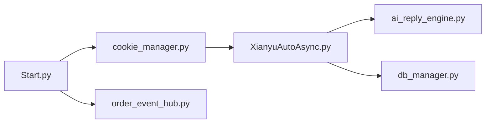

# GuDong2003/xianyu-auto-reply-fix

> Plateforme de gestion de boutiques Xianyu : réponses automatiques, livraison, commandes, multi-comptes.

## Le problème
Un vendeur sur la place de marché Xianyu doit répondre et livrer en continu, à la main.

## Ce que ça fait vraiment
Application FastAPI + SQLite + Playwright. Chaque compte vendeur a une instance qui suit les messages en WebSocket ; réponses par mots-clés ou par IA (OpenAI-compatible, Gemini, Anthropic, DashScope…), livraison automatique, gestion de produits et commandes, notifications, journaux temps réel. Interface web multi-utilisateurs.

## Comment c'est branché


## Essayer
```bash
git clone https://github.com/GuDong2003/xianyu-auto-reply-fix.git
cd xianyu-auto-reply-fix
docker compose up -d
```

## Coût et pièges
Mot de passe admin par défaut `admin123` et clé JWT à remplacer ; ne pas exposer VNC (5900/6080) ; clé d'API IA à ta charge ; cookies de compte sensibles.

## Ce que ce n'est pas
Pas un projet officiel : aucun lien avec Xianyu ou Alibaba. Les changements d'interface de la plateforme peuvent casser l'outil.

## Alternatives
XianyuAutoAgent et xianyu-auto-reply (sources d'inspiration citées dans le README).

## Pour toi
À ignorer : outil d'automatisation d'une plateforme chinoise précise, avec risques de compte et AGPL, sans rapport avec ton profil.

