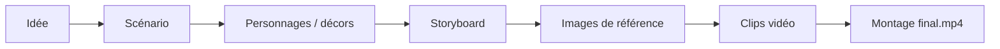

# HITsz-TMG/FilmAgent

> Application web qui transforme une idée en vidéo complète, du scénario au montage, via des modèles hébergés.

## Le problème
Produire une vidéo narrative demande de chaîner scénario, personnages, plans, images et vidéo, chaque étape dans un outil différent, sans contrôle intermédiaire.

## Ce que ça fait vraiment
Le README présente VideoClaw (le dépôt a changé de contenu) : pipeline en étapes avec assets modifiables — scénario, personnages et décors, storyboard, images de référence, clips vidéo, montage. Trois modes de génération vidéo (première image, première et dernière, images de référence). Utilisable en interface web, depuis WeChat ou Feishu, ou comme skill OpenClaw. Pipelines légers : vidéo d'illustration, transfert de mouvement, présentateur numérique. Le schéma décrit l'ancien FilmAgent (agents et Unity), non fidèle au README actuel.

## Comment c'est branché


## Essayer
```bash
git clone https://github.com/HITsz-TMG/VideoClaw.git
cd VideoClaw/video-claw/video-claw
chmod +x install.sh && ./install.sh
cd backend && uv run python api_server.py
cd ../frontend && npm start
```

## Coût et pièges
Clés à ta charge pour LLM, image et vidéo (OpenAI, Gemini, DeepSeek, DashScope, ARK, Kling selon les modèles choisis). Génération vidéo facturée au clip. Prévoir ffmpeg, Python 3.9+, Node 18+.

## Ce que ce n'est pas
Pas un modèle de génération vidéo : il orchestre des services tiers. Le nom du dépôt (FilmAgent) ne correspond plus au contenu du README (VideoClaw).

## Alternatives
Aucune alternative nommée dans le README (il cite Pixelle-Video, huobao-drama, Flova comme inspirations).

## Pour toi
À surveiller : exemple concret d'orchestration multi-modèles avec étapes éditables, mais le coût par génération et la confusion FilmAgent/VideoClaw invitent à tester avant d'adopter.
