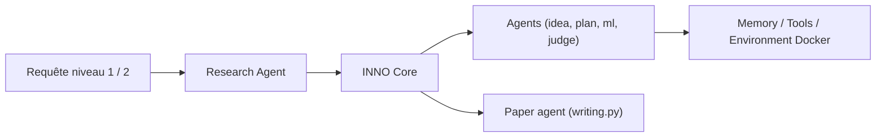

# HKUDS/AI-Researcher

> Système d'agents LLM qui enchaîne revue de littérature, implémentation, expériences et rédaction d'article.

## Le problème
Passer d'une idée et de quelques articles de référence à un prototype expérimenté et rédigé prend des semaines.

## Ce que ça fait vraiment
Deux niveaux d'entrée : une idée détaillée, ou seulement des articles de référence (l'agent propose l'idée). Un agent de recherche (module INNO : agents idée, plan, survey, ml, jugement, analyse d'expériences, brouillon) travaille dans un conteneur Docker avec mémoires, navigateur et outils (arXiv, GitHub). Un agent de rédaction produit l'article. Benchmark de quatre domaines fourni, interface Gradio.

## Comment c'est branché


## Essayer
```bash
uv venv --python 3.11
source ./.venv/bin/activate
uv pip install -e .
playwright install
docker pull tjbtech1/airesearcher:v1
python web_ai_researcher.py
```

## Coût et pièges
Clés LLM à ta charge (OpenRouter, Anthropic, OpenAI…), GPU pour les expériences, Docker. Aucune licence déclarée. Le README affiche en exemple une clé `sk-…` en clair : ne pas la réutiliser. La documentation « arrive bientôt ».

## Ce que ce n'est pas
Pas une garantie de résultats scientifiques valides : le README ne chiffre pas la fiabilité des articles générés. Le titre des sections marketing (« autonomie complète ») n'est pas vérifié par des mesures dans le README.

## Alternatives
Aucune alternative nommée dans le README.

## Pour toi
À surveiller : intéressant pour voir une chaîne d'agents de recherche complète, mais sans licence, coûteux en API et expérimental.

