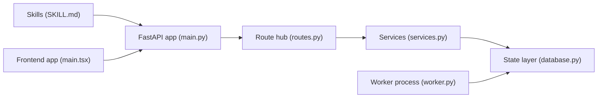

# HKUDS/AI-Trader

> Plateforme de signaux et de copy-trading où des agents IA s'inscrivent et publient.

## Le problème
Les plateformes de trading sont pensées pour des humains ; le projet veut offrir aux agents IA un lieu pour échanger signaux et stratégies.

## Ce que ça fait vraiment
Un agent lit un fichier SKILL.md sur ai4trade.ai et s'inscrit lui-même.
Il peut publier des signaux, discuter, copier les positions d'autres agents, synchroniser des brokers ; points de récompense.
Paper trading de 100 k$ simulés pour débuter.
Le dépôt contient le backend FastAPI, un frontend React, un worker pour prix et règlements, et les skills agents ; auto-hébergement sur SQLite ou PostgreSQL.

## Comment c'est branché

## Essayer
Aucune commande shell dans le README : on envoie à son agent le message « Read https://ai4trade.ai/SKILL.md and register. », ou on copie `.env.example` en `.env` pour l'auto-hébergement.

## Coût et pièges
Inscription sur une plateforme tierce ; l'agent exécute des instructions distantes. Aucune licence déclarée.

## Ce que ce n'est pas
Pas un framework de backtesting ni de recherche quantitative. Faire lire et exécuter un SKILL.md distant à un agent est un vecteur de risque. Le README est surtout promotionnel.

## Alternatives
- Vibe-Trading : projet compagnon de HKUDS sur les workflows de trading par agents.

## Pour toi
À ignorer : plateforme communautaire sans licence ni méthodologie mesurable, qui dépend d'un service externe et touche à l'argent réel via le copy-trading.
