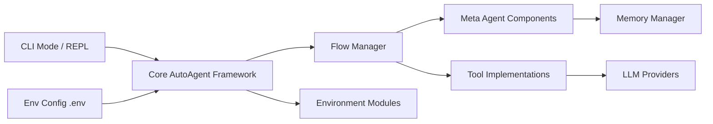

# HKUDS/AutoAgent

> Framework Python de laboratoire qui crée agents, outils et workflows LLM à partir d'instructions en langage naturel.

## Le problème
Assembler un système multi-agents demande d'écrire à la main outils, profils et orchestration. AutoAgent veut remplacer ce code par un dialogue.

## Ce que ça fait vraiment
CLI (`auto main`, `auto deep-research`) avec trois modes : `user mode` (assistant de recherche multi-agents), `agent editor` et `workflow editor`. Les éditeurs génèrent du code d'outils et d'agents dans un miroir cloné du dépôt, exécuté dans un conteneur Docker. Les modèles passent par LiteLLM (Claude 3.5 Sonnet par défaut). Des scripts reproduisent les résultats GAIA et Agentic-RAG du papier.

## Comment c'est branché


## Essayer
```bash
git clone https://github.com/HKUDS/AutoAgent.git
cd AutoAgent
pip install -e .
auto main
COMPLETION_MODEL=gpt-4o auto main
```

## Coût et pièges
Docker obligatoire (l'image est tirée automatiquement), un `GITHUB_AI_TOKEN` requis et une clé de fournisseur LLM à ta charge. La doc détaillée est annoncée « coming soon ».

## Ce que ce n'est pas
Pas un framework stable à intégrer : c'est le code d'un papier (arXiv 2502.05957). Le « zéro code » génère du code que tu dois relire, et le mode workflow ne crée pas encore d'outils.

## Alternatives
Aucune alternative nommée dans le README (seul le projet frère Auto-Deep-Research est cité).

## Pour toi
À surveiller comme démonstrateur de génération d'agents, pas à adopter : documentation absente, dernier push octobre 2025 et dépendance à Docker plus plusieurs clés rendent l'usage réel coûteux.
