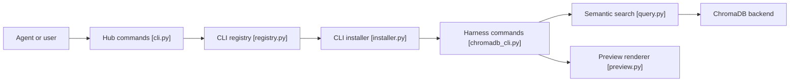

# HKUDS/CLI-Anything

> Générateur et catalogue de CLI qui rendent des logiciels existants pilotables par des agents IA.

## Le problème
Les agents raisonnent bien mais pilotent mal les logiciels professionnels : automatisation d'interface fragile ou API limitées.

## Ce que ça fait vraiment
Deux volets. CLI-Hub (`cli-hub`) : registre pour lister, installer et lancer des CLI communautaires. Générateur : un plugin ou skill d'agent (Claude Code, Codex, Cursor, OpenClaw, etc.) qui suit sept phases (analyse, conception, implémentation, plans de tests, tests, doc, publication) pour produire un CLI Click avec REPL, sortie `--json` et fichier `SKILL.md`. Chaque CLI appelle le vrai logiciel.

## Comment c'est branché


## Essayer
```bash
pip install cli-anything-hub
cli-hub list
cli-hub search image
cli-hub install gimp
cli-hub launch gimp
npx skills add HKUDS/CLI-Anything --skill cli-hub-meta-skill -g -y
/plugin marketplace add HKUDS/CLI-Anything
/plugin install cli-anything
/cli-anything ./gimp
```

## Coût et pièges
Python 3.10+, un agent de code et le logiciel cible installé. Les limites annoncées : modèles de pointe requis, source disponible, raffinements itératifs. Les jetons de l'agent sont à ta charge. `-g -y` installe globalement sans confirmation.

## Ce que ce n'est pas
Ce n'est pas une garantie de couverture : un CLI généré peut être partiel. Les chiffres de tests du README sont incohérents (2 280+, 2 461, 2 464 ; « 18 applications » contre plus de quarante listées).

## Alternatives
Aucune alternative nommée dans le README.

## Pour toi
À surveiller : idée forte pour outiller des agents, mais jeune (mars 2026), plusieurs plateformes marquées expérimentales et résultats dépendants du modèle.

