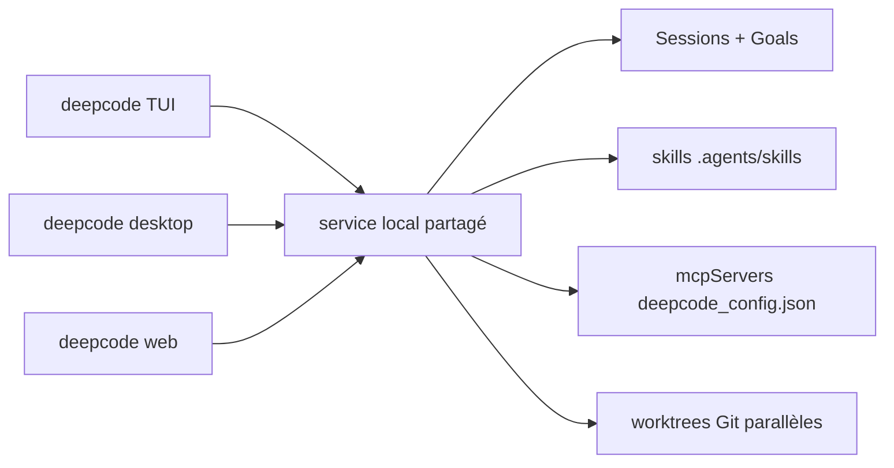

# HKUDS/DeepCode

> Agent de codage local à trois interfaces, issu d'un projet de reproduction de papiers.

## Le problème
Un agent qui génère du code s'arrête souvent à la suggestion : il ne relit pas le
projet, ne vérifie pas le résultat et perd tout à la première interruption.

## Ce que ça fait vraiment
Un service local partagé sert trois clients — TUI `deepcode`, `deepcode desktop`,
`deepcode web` — qui partagent projets, sessions, modèles, skills, permissions,
objectifs et automatisations. Un « Goal » durable fait tourner l'agent sur plusieurs
tours : on peut ajouter des informations, réviser le but, mettre en file, arrêter,
reprendre après redémarrage. Vérification par tests, builds, diagnostics, diffs et
artefacts, pas par une réponse plausible. Skills dans `.agents/skills` et
`~/.agents/skills`, lecture des répertoires Claude sans migration. Trois modes de
permission (Ask, Read only, Full access) et agents parallèles isolés en worktrees
Git. Paper2Code reste le flux dédié à la reproduction de recherche.

## Comment c'est branché


## Essayer
```bash
uv tool install --python 3.12 deepcode-hku
deepcode init
deepcode provider set my-openrouter --template openrouter --api-key
deepcode provider test my-openrouter --model MODEL_ID
deepcode --trust --connection my-openrouter --model MODEL_ID
```

## Coût et pièges
Aucun compte DeepCode, mais la clé d'API du fournisseur est à votre charge et une
boucle Goal consomme beaucoup de tokens. Python 3.12+, Node 22+ pour l'install
depuis les sources, Rust en plus pour le Desktop source. Fermer un client laisse
les tâches acceptées en cours : la machine doit rester éveillée.

## Ce que ce n'est pas
Pas un service hébergé : tout est local, sessions comprises. Le mode « Full access »
retire explicitement les approbations et le bac à sable filesystem — ce n'est pas
un détail. Le README est tronqué avant la fin. Aucune licence déclarée.

## Alternatives
- Aucun dépôt alternatif nommé dans le README.

## Pour toi
Concurrent direct de ce que tu utilises déjà ; l'angle Paper2Code est le seul
différenciant à tester. Surveiller.
