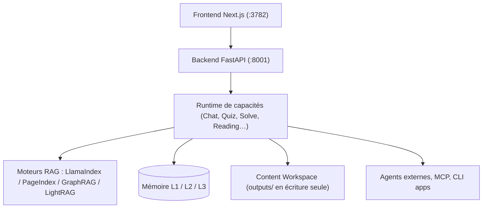

# HKUDS/DeepTutor

> Espace de travail d'apprentissage agentique : tutorat, quiz, recherche, lecture et visualisation.

## Le problème
Apprendre à partir de ses propres documents éclate entre un lecteur PDF, un chat, un outil de
quiz et des notes, sans mémoire commune ni progression suivie.

## Ce que ça fait vraiment
Fait tourner Chat, Ask Questions, Quiz, Research, Visualize, Solve, Course Study, Mastery Path,
Immersive Reading et Immersive Watching sur un seul runtime de capacités et un contexte partagé.
Réunit bases de connaissances, livres, brouillons Co-Writer, carnets, banques de questions,
personas et mémoire, réutilisables entre les workflows selon les droits du compte.
Accepte une URL YouTube pour une lecture native avec sous-titres synchronisés et tutorat ancré
sur l'horodatage. Permet de consulter en direct un agent externe (Claude Code, Codex, Antigravity,
Kimi, opencode…) ou un Partner. Côté RAG, versionne des bibliothèques sur LlamaIndex, PageIndex,
GraphRAG, LightRAG, WeKnora, une bibliothèque IMA ou MarginNote 4, ou un coffre Obsidian lié.
La mémoire est inspectable sur trois couches : traces L1, résumés L2, synthèse L3.

## Comment c'est branché


## Essayer
```bash
mkdir -p my-deeptutor && cd my-deeptutor
pip install -U deeptutor
deeptutor init
deeptutor start
docker run --rm --name deeptutor -p 127.0.0.1:3782:3782 -v deeptutor-data:/app/data ghcr.io/hkuds/deeptutor:latest
```

## Coût et pièges
Le logiciel est gratuit, les modèles non : `deeptutor init` demande fournisseur, base URL, clé et
modèle. Il faut Python 3.11–3.14 **et** Node.js 20+ sur le PATH, même pour l'installation PyPI.
Le rythme de publication est très soutenu (plusieurs versions par semaine), avec un refactor
front/back annoncé comme cassant en 1.6.3.

## Ce que ce n'est pas
Ce n'est pas un service hébergé : tout tourne chez toi, avec un volume de données à sauvegarder.
L'exécution est en lecture seule hors de `outputs/`, et le bac à sable système n'est que
« best effort » en repli local. Ce n'est pas un projet stabilisé : l'historique le montre en
mouvement permanent.

## Alternatives
- **LightRAG** : moteur RAG du même laboratoire, intégré ici comme option de première classe.
- **Open Notebook** : intégré comme source de connaissances via un skill dédié.

## Pour toi
À regarder pour ses idées — mémoire en trois couches, RAG multi-moteurs — plus que pour l'adopter.
