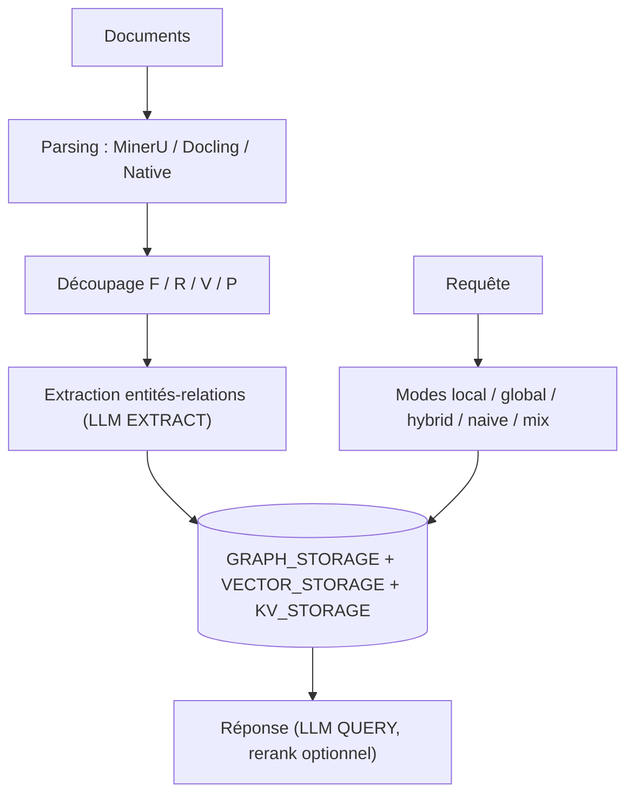

# HKUDS/LightRAG

> RAG à graphe de connaissances, alternative légère à GraphRAG, avec serveur et interface web.

## Le problème
Le RAG par morceaux perd le contexte entre documents, et GraphRAG le rétablit au prix d'appels
LLM nombreux, de temps de réponse longs et de mises à jour coûteuses.

## Ce que ça fait vraiment
Tient une architecture à deux couches — graphe de connaissances et vecteurs — et une récupération
à deux niveaux qui mêle faits précis et concepts abstraits.
Évite les rapports de communauté et le raisonnement multi-sauts, ce qui réduit le nombre d'appels
LLM à l'indexation comme à la requête. Gère les mises à jour incrémentales et la suppression
sélective : à la suppression d'un document, le cache LLM d'indexation sert à reconstruire vite
les entités et relations touchées.
Propose cinq modes de requête (`local`, `global`, `hybrid`, `naive`, `mix`, `mix` par défaut),
quatre stratégies de découpage dont une sémantique par paragraphe alignée sur les titres et tableaux,
et plusieurs moteurs de parsing (MinerU, Docling, Native). Depuis la v1.5, le multimodal
(images, formules, tableaux) est relié au texte via le graphe.

## Comment c'est branché


## Essayer
```bash
uv tool install "lightrag-hku[api]"
cp env.example .env
lightrag-server
git clone https://github.com/HKUDS/LightRAG.git && cd LightRAG
docker compose up
make env-base
```

## Coût et pièges
Quatre rôles de modèle à configurer (EXTRACT, QUERY, KEYWORD, VLM), donc quatre lignes de facture ;
le README insiste pour que EXTRACT et KEYWORD soient des modèles **non** pensants. Les stockages
par défaut sont en mémoire et explicitement inadaptés à la production : PostgreSQL recommandé.
Alerte de sécurité dans le README lui-même : le serveur écoute sur `0.0.0.0` et, sans authentification
configurée, tous les endpoints sont publics. Le modèle d'embedding ne peut plus changer après indexation.

## Ce que ce n'est pas
Ce n'est pas plug-and-play : la configuration par défaut « ne permet pas au système de donner
le meilleur ». Ce n'est pas un service : c'est une bibliothèque plus un serveur à exploiter.
Ce n'est pas indépendant du LLM : il exige des modèles capables d'extraction d'entités fiable.

## Alternatives
- **Microsoft GraphRAG** : la référence dont LightRAG se pose en alternative moins coûteuse.

## Pour toi
Le candidat sérieux si ton RAG bute sur des questions transverses à plusieurs documents.
