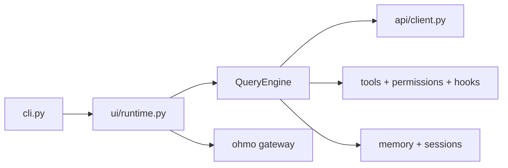

# HKUDS/OpenHarness

> Harnais d'agent Python open source (boucle, outils, mémoire, multi-agents) et son agent personnel ohmo.

## Le problème
Autour d'un LLM, il faut boucle d'outils, permissions, mémoire et coordination ; les implémentations de production sont fermées.

## Ce que ça fait vraiment
La commande `oh` lance une boucle d'agent : requête, flux, appel d'outil, permissions et hooks, résultat. Plus de 43 outils (fichiers, shell, web, MCP, tâches), compétences `SKILL.md`, plugins compatibles Claude Code, fournisseurs Anthropic/OpenAI-compatibles, Copilot, Codex, Ollama. `ohmo` relie l'agent à Feishu, Slack, Telegram, Discord. Le mode `--dry-run` simule sans appeler le modèle.

## Comment c'est branché


## Essayer
```bash
pip install openharness-ai
oh setup
oh
oh --dry-run
ohmo init
```

## Coût et pièges
Clé d'API du fournisseur, ou abonnement Claude/Codex existant. Le mode `Auto` autorise tout : réserver aux sandbox. Les versions sont en 0.1.x, créé en avril 2026, dernier push juin 2026.

## Ce que ce n'est pas
Ce n'est pas un modèle. Le README revendique des résultats de tests, mais ce sont ses propres suites (114 tests), pas une évaluation externe.

## Alternatives
OpenClaw, nanobot et Cursor sont cités comme agents CLI intégrables ; Claude Code est la référence dont il reprend les formats.

## Pour toi
À surveiller : base lisible pour comprendre et bricoler un agent, mais très jeune (0.1.x), donc pas encore un socle de production.

