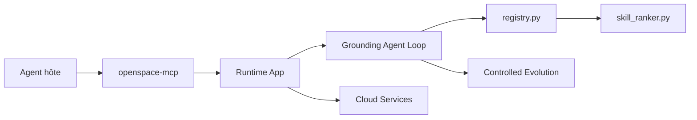

# HKUDS/OpenSpace

> Couche de gestion de skills pour agents (MCP) : retrouver, évaluer et faire évoluer des SKILL.md.

## Le problème
Avec des centaines de skills, l'agent ne trouve plus la bonne, réutilise celles qui échouent et ne tire aucune leçon de ses échecs.

## Ce que ça fait vraiment
Un serveur MCP (`openspace-mcp`), une CLI, une API Python et un dashboard partagent le même runtime.
Classement hybride BM25 + embeddings, stockage SQLite des versions et des métriques de qualité.
Évolution FIX / DERIVED / CAPTURED avec validation ; statut provisoire, puis de confiance après usage réussi.
Hub cloud optionnel pour partager des skills, avec import local explicite.

## Comment c'est branché


## Essayer
```bash
git clone https://github.com/HKUDS/OpenSpace.git && cd OpenSpace
pip install -e .
openspace-mcp --help
openspace --model "anthropic/claude-sonnet-4-5" --query "Create a monitoring dashboard for my Docker containers"
```

## Coût et pièges
Il faut Python 3.12+, une clé LLM et Node 20 pour le dashboard. Le cloud envoie de la télémétrie de qualité et de traces (avec caviardage).

## Ce que ce n'est pas
Pas un agent autonome prêt à l'emploi : c'est une couche à brancher. Le mode évolution `autonomous` est actif par défaut et réécrit les skills.

## Alternatives
Aucune alternative nommée dans le README.

## Pour toi
À surveiller : l'idée de noter les skills sur preuves colle à ton usage de Claude Code, mais le projet a six mois et son évolution automatique réécrit tes skills par défaut.
