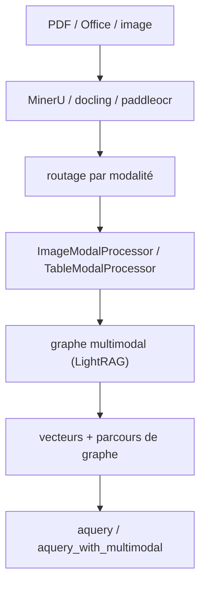

# HKUDS/RAG-Anything

> RAG multimodal bâti sur LightRAG, pour interroger des PDF mêlant texte, images, tables et formules.

## Le problème
Un RAG textuel jette tout ce qui n'est pas du texte : les figures, les tableaux et les équations
d'un rapport ou d'un article disparaissent de l'index, et les réponses s'appuient sur la moitié du document.

## Ce que ça fait vraiment
Un pipeline en cinq étapes : parsing (MinerU, docling ou paddleocr ; PDF, Office, images), routage
du contenu par modalité, analyse par processeurs dédiés (`ImageModalProcessor`, `TableModalProcessor`,
équations LaTeX, `GenericModalProcessor` extensible), construction d'un graphe de connaissances
multimodal avec relations `belongs_to`, puis récupération hybride vecteurs + graphe.
Trois familles de requêtes : `aquery` (modes hybrid/local/global/naive), requêtes VLM automatiques,
et `aquery_with_multimodal` avec un contenu fourni à la main.

## Comment c'est branché


## Essayer
```bash
pip install raganything
mineru --version
python -c "from raganything import RAGAnything; rag = RAGAnything(); print('✅ MinerU installed properly' if rag.check_parser_installation() else '❌ MinerU installation issue')"
uv sync --all-extras
```

## Coût et pièges
Chaque image passe par un modèle de vision (`gpt-4o` dans les exemples) et chaque document par un LLM :
l'ingestion coûte, pas seulement l'interrogation. Les documents Office exigent LibreOffice installé.
Les extras `[image]` et `[text]` sont nécessaires pour BMP/TIFF/GIF/WebP et TXT/MD. Les modèles MinerU
se téléchargent au premier usage. Le README est tronqué avant la fin de la section « instance existante ».

## Ce que ce n'est pas
Pas indépendant : c'est une couche au-dessus de LightRAG, dont il hérite le stockage et les modes.
Pas prêt à l'emploi : il faut écrire soi-même `llm_model_func`, `vision_model_func` et `embedding_func`.
Les chiffres du tableau d'exemple (95,2 % contre 87,3 %) sont un contenu de démonstration, pas un banc d'essai.

## Alternatives
- LightRAG : la base, si le multimodal n'est pas nécessaire.
- docling / paddleocr : parseurs alternatifs à MinerU, réglables par `parser=`.

## Pour toi
Le candidat sérieux si tes corpus sont des PDF techniques ; mesure le coût d'ingestion sur un seul document d'abord.
