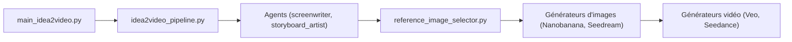

# HKUDS/ViMax

> Framework d'agents qui produit une vidéo à partir d'une idée, d'un scénario ou d'un roman.

## Le problème
Les générateurs vidéo ne produisent que quelques secondes, avec des personnages incohérents et sans scénario.

## Ce que ça fait vraiment
Des pipelines (`idea2video`, `script2video`) enchaînent des agents : extraction de personnages et de scènes, storyboard, choix d'images de référence, génération d'images puis de vidéos, assemblage. Les modèles de chat, d'image et de vidéo sont appelés via des API configurées en YAML. Une TUI et une interface web existent.

## Comment c'est branché


## Essayer
```bash
git clone https://github.com/HKUDS/ViMax.git
cd ViMax
uv sync
cp configs/agent.example.yaml configs/agent.local.yaml
vimax tui
cd web
npm install
npm run dev
```

## Coût et pièges
Trois clés d'API à ta charge (LLM, image, vidéo), donc facture selon la longueur des vidéos. Le coût n'est pas chiffré dans le README.

## Ce que ce n'est pas
Pas un modèle de génération : il orchestre des services externes. La qualité « movie-grade » du README n'est pas mesurée.

## Alternatives
Aucune alternative nommée dans le README.

## Pour toi
Surveiller : bon exemple d'orchestration multi-agents, mais coûteux et dépendant de fournisseurs tiers.

