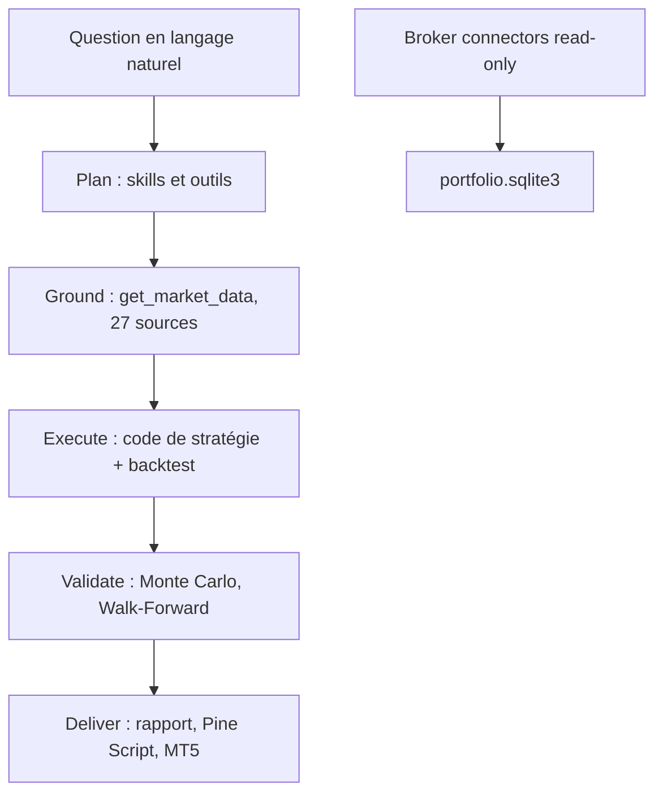

# HKUDS/Vibe-Trading

> Espace de recherche financière piloté par agent : données, backtests, rapports, connecteurs courtiers.

## Le problème
Passer d'une question de marché à une analyse exécutable suppose de recoller loaders de données, moteur de backtest, métriques et rapport.
Chaque source de données a son API, ses quotas et son risque de blocage d'IP.

## Ce que ça fait vraiment
Transforme une question en langage naturel en analyse exécutable : recherche de marché, génération de code de stratégie, backtest, validation (Monte Carlo, Bootstrap, Walk-Forward), rapport et export.
Un appel `get_market_data`, 27 sources, chaîne de repli par marché ordonnée selon le risque de blocage d'IP : A-share, US, HK, Inde, Corée, UK, crypto, forex/métaux ; 22 outils de données en lecture seule exposés en MCP.
Shadow Account : lit un export de courtier, profile le comportement (durée de détention, taux de réussite, effet de disposition, surtrading), extrait les règles implicites et les rejoue en backtest.
462 alphas préconstruits (Qlib 158, Kakushadze 101, GTJA 191, académiques, fondamentaux PIT-safe), 30 préréglages d'équipes d'agents, 18 connecteurs courtiers avec garde structurelle papier/live.

## Comment c'est branché


## Essayer
```bash
pip install vibe-trading-ai
vibe-trading run -p "Backtest a BTC-USDT 20/50 moving-average strategy for 2024, summarize return and drawdown, then export the report"
vibe-trading alpha bench --zoo gtja191 --universe csi300 --period 2018-2025 --top 20
vibe-trading connector setup okx-live-sdk-readonly --connection-id main-okx --label "Main OKX"
```

## Coût et pièges
Les 23 sources intégrées sont gratuites et sans clé ; QVeris est une place de marché premium à crédits, avec lien de parrainage assumé dans le README.
Le trading autonome via un courtier que vous autorisez existe : le README borne cela par mandat utilisateur (allowlist, plafonds, kill switch) et refuse structurellement le live sur les courtiers sans discriminateur papier/live.

## Ce que ce n'est pas
Ce n'est pas un conseil financier ni un robot de trading clé en main : le positionnement est recherche, simulation et backtest.
Ce n'est pas sans risque d'argent réel : la voie live existe, et les clés de courtier ne doivent jamais passer par un chat IA (le README le répète).
Ce n'est pas un projet mûr : de nombreux connecteurs sont marqués « Experimental », non vérifiés par courtier ; le README fourni est tronqué au milieu de la table des moteurs de backtest.

## Alternatives
Aucune alternative n'est nommée ; le projet cite Qlib comme source d'alphas, pas comme concurrent.

## Pour toi
À regarder pour le mécanisme (fallback de sources, garde papier/live, alpha zoo) plus que pour trader ; ne jamais brancher de compte réel.
