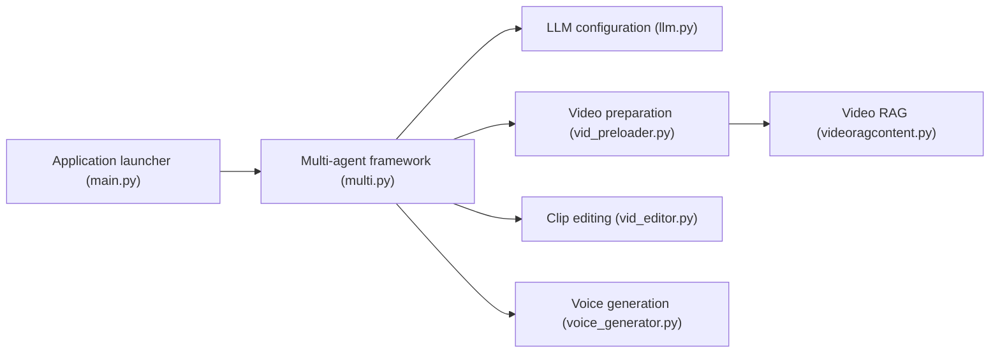

# HKUDS/VideoAgent

> Framework multi-agents pour comprendre, monter et remixer des vidéos par instructions en langage naturel.

## Le problème
Monter, résumer ou refaire une vidéo demande de chaîner à la main transcription, retrieval, voix et montage.

## Ce que ça fait vraiment
Analyse l'intention, génère un graphe de workflow d'agents avec boucle d'auto-évaluation, puis exécute : Q&A et résumé, montage et synchronisation sur le rythme, vidéos de commentaire, remakes (mèmes, clips musicaux, stand-up interculturel). Utilise CosyVoice, fish-speech, seed-vc, DiffSinger, Whisper, ImageBind ; VideoRAG pour l'indexation. Les évaluations du README sont internes.

## Comment c'est branché


## Essayer
```bash
git clone https://github.com/HKUDS/VideoAgent.git
conda create --name videoagent python=3.10
conda activate videoagent
conda install -y -c conda-forge pynini==2.1.5 ffmpeg
pip install -r requirements.txt
python main.py
```

## Coût et pièges
GPU 8 Go, téléchargement de plusieurs checkpoints, clés Claude (obligatoire pour le routeur), DeepSeek, GPT et Gemini selon le scénario. Le contenu des démos vient d'internet, droits non garantis.

## Ce que ce n'est pas
Pas un produit clé en main : le README est très promotionnel, les résultats sont auto-rapportés et les détails des rôles n'ont pas été inspectés.

## Alternatives
- Director, Funclip, NarratoAI, NotebookLM : comparés dans le tableau du README, avec moins de fonctions créatives.

## Pour toi
À surveiller : recherche intéressante côté agents multimodaux, mais l'installation lourde et quatre clés d'API en font un banc d'essai, pas un outil.
