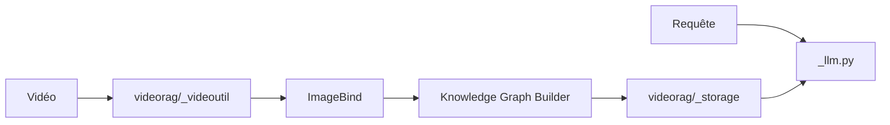

# HKUDS/VideoRAG

> Cadre de RAG pour très longues vidéos, avec application de bureau Vimo, pour chercheurs.

## Le problème
Interroger des dizaines d'heures de vidéo dépasse le contexte des modèles multimodaux.

## Ce que ça fait vraiment
Les vidéos sont découpées, transcrites (ASR), légendées, encodées avec ImageBind, puis indexées dans un graphe de connaissances multimodal et une base vectorielle (Neo4j, hnswlib, nano-vectordb). À la requête, une récupération adaptative alimente un LLM (OpenAI ou Ollama). Les auteurs annoncent 134 heures sur un seul RTX 3090 et un benchmark LongerVideos (164 vidéos, 602 requêtes). L'application Vimo (Electron) est annoncée comme bientôt disponible.

## Comment c'est branché

## Essayer
Aucune commande d'installation n'est donnée dans ce README : il renvoie aux dossiers `Vimo-desktop` et `VideoRAG-algorithm` (environnement conda, points de contrôle, dépendances). Le téléchargement de l'application est « bientôt disponible ».

## Coût et pièges
GPU de 24 Go conseillé, modèles à télécharger, appels LLM à ta charge si OpenAI. La licence est présente mais non reconnue par GitHub. Dernier push en mars 2026.

## Ce que ce n'est pas
Pas une application prête à installer : la version binaire n'existe pas encore. Les performances (60,2 % sur Video-MME long) sont celles des auteurs et l'écart entre exécutions est signalé.

## Alternatives
Aucune alternative n'est nommée dans le README (seuls les modèles MiniCPM sont cités comme base de comparaison).

## Pour toi
À surveiller : idée de graphe multimodal pour vidéos longues intéressante, mais installation non documentée ici, licence floue et matériel lourd.
