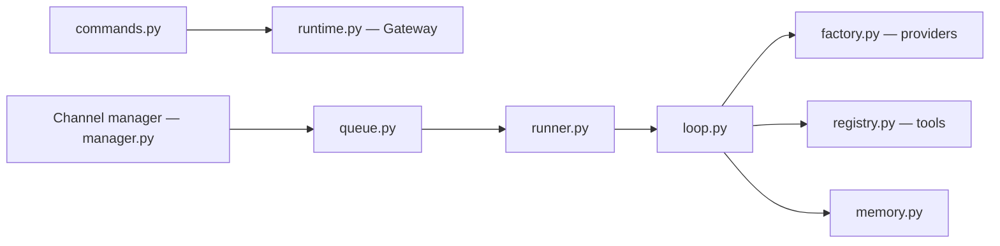

# HKUDS/nanobot

> Framework Python d'agent IA personnel auto-hébergé, accessible par WebUI, terminal ou messageries.

## Le problème
Un agent personnel qui garde mémoire, outils et tâches planifiées demande souvent une plateforme lourde et opaque.

## Ce que ça fait vraiment
Boucle LLM/outils (`agent/loop.py`) avec outils fichiers, shell, web, MCP, cron, sous-agents.
Mémoire longue et sessions persistées ; automatisations planifiées et déclencheurs locaux.
Canaux Telegram, Slack, Discord, WeChat, email… ; API compatible OpenAI et SDK Python.
Fournisseurs avec fallback (Anthropic, OpenAI, Bedrock, locaux) ; politique d'accès au workspace.

## Comment c'est branché


## Essayer
```bash
uv tool install nanobot-ai
nanobot --version
nanobot webui
nanobot -m "Hello!"
```

## Coût et pièges
Clé de fournisseur LLM ou modèle local. Python ≥ 3.11. Déploiement Render : disque persistant payant.

## Ce que ce n'est pas
Pas un modèle ; l'accès shell et fichiers donne un vrai pouvoir à l'agent, à cadrer via le mode d'accès.

## Alternatives
- OpenClaw : cité comme point de départ pour un usage « gateway-first ».

## Pour toi
Bon candidat pour un assistant personnel auto-hébergé ; à tester sur un workspace restreint.
