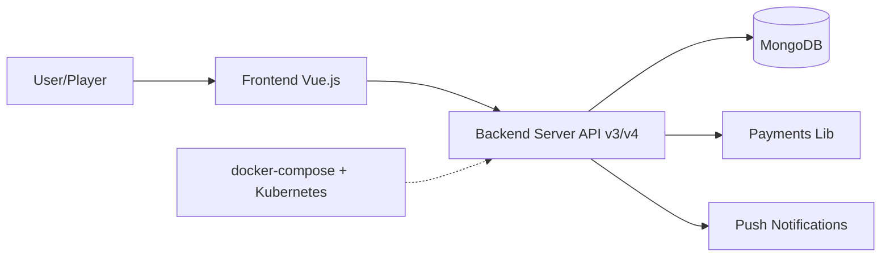

# HabitRPG/habitica

> Application web open source qui transforme habitudes et tâches en jeu de rôle, pour qui veut se motiver.

## Le problème
Tenir ses habitudes et sa to-do list sans récompense immédiate est démotivant.

## Ce que ça fait vraiment
Client Vue.js et serveur Node/Express (API v3 et v4) sur MongoDB. Les tâches accomplies donnent niveaux et or, les échecs coûtent des points de vie. Paiements Stripe, PayPal, Amazon, Apple et Google, notifications push. Apps mobiles dans des dépôts séparés (Android, iOS).

## Comment c'est branché

## Essayer
Aucune commande d'installation dans le README : il renvoie au wiki GitHub (« Setting up Habitica Locally »). Le code mentionne un `Dockerfile-Dev` et des fichiers docker-compose.

## Coût et pièges
Gratuit en local. Depuis le 4 août 2026, les contributions de code sont suspendues et le code généré par IA est interdit. Les bugs se signalent par e-mail à l'admin, pas par issue.

## Ce que ce n'est pas
Pas un projet ouvert aux contributions actuellement. La licence est « décrite » dans un fichier LICENSE que GitHub n'identifie pas : à lire avant tout réemploi.

## Alternatives
Aucune alternative citée dans le README.

## Pour toi
À ignorer pour un profil data/IA/MLOps : c'est une app grand public, sans lien avec ton métier, et fermée aux contributions ; utile seulement comme étude d'architecture Vue/Node/Mongo.

