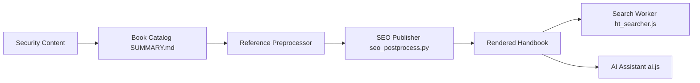

# HackTricks-wiki/hacktricks

> Base de connaissances multilingue de cybersécurité, à lire en ligne, pour praticiens de la sécurité.

## Le problème
Les techniques de sécurité sont dispersées entre articles, dépôts et notes personnelles. Une référence unique et indexée évite de les rechercher une à une.

## Ce que ça fait vraiment
Le README lu se limite à la mention « src/README.md » : la matière est insuffisante. D'après l'architecture décrite, le dépôt regroupe des guides par domaine (web, exploitation binaire, durcissement de plateformes, sécurité de l'IA), un catalogue SUMMARY.md, un préprocesseur et un publieur SEO. Le livre rendu offre recherche, coloration syntaxique, navigation, un assistant IA, et des modules de sponsors et de formation.

## Comment c'est branché

## Essayer
Aucune commande documentée dans le README lu. Le contenu se consulte en ligne ; l'URL n'y figure pas.

## Coût et pièges
Gratuit à la lecture. L'assistant IA et les sponsors s'appuient sur des services tiers. Licence non déclarée dans le catalogue : réutilisation du contenu à vérifier.

## Ce que ce n'est pas
Ce n'est pas un outil exécutable ni une formation structurée. Certains détails de déploiement n'ont pas été examinés. Les techniques décrites ne s'appliquent légitimement qu'à des systèmes autorisés.

## Alternatives
Aucune alternative nommée dans le README.

## Pour toi
À surveiller : référence utile pour la sécurité des déploiements et la sécurité de l'IA, mais ne pas réutiliser le contenu tant que la licence n'est pas clarifiée.

