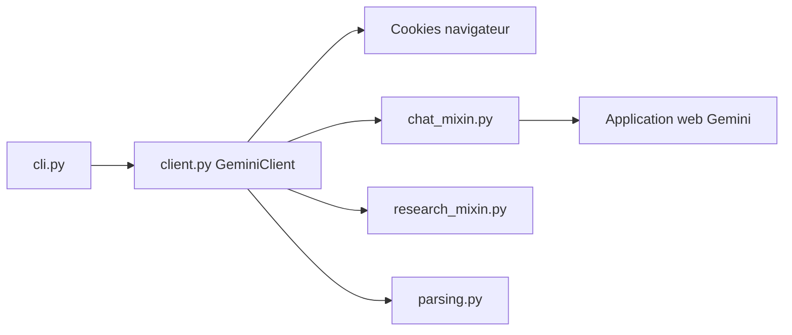

# HanaokaYuzu/Gemini-API

> Enveloppe Python asynchrone, obtenue par rétro-ingénierie, qui pilote l'application web Gemini avec ton compte Google.

## Le problème
Utiliser les fonctions de l'application Gemini (Gems, extensions, Deep Research, génération d'images et de vidéos) sans passer par l'API officielle.

## Ce que ça fait vraiment
`GeminiClient` s'authentifie avec les cookies `__Secure-1PSID` et `__Secure-1PSIDTS`, les rafraîchit en arrière-plan, puis envoie prompts et fichiers. Il gère les conversations, l'historique, les Gems, les extensions (Gmail, YouTube), le streaming, les images, vidéos et audio générés, et Deep Research (plan, confirmation, sondage, rapport). Un CLI (`cli.py`) existe. Les modèles disponibles sont découverts dynamiquement par compte.

## Comment c'est branché


## Essayer
```bash
pip install -U gemini_webapi
pip install -U gemini_webapi[browser]
python cli.py --cookies-json cookies.json ask "What is quantum computing?"
```

## Coût et pièges
Il faut extraire des cookies de session de ton navigateur ; sur Chromium ils peuvent n'être valables que quelques heures, Firefox est recommandé. Python 3.11+. Video, audio et Deep Research demandent parfois un abonnement.

## Ce que ce n'est pas
Pas l'API officielle : elle peut casser à tout changement côté Google et touche ton compte personnel. Licence AGPL-3.0, avec les obligations de publication qui vont avec.

## Alternatives
Le README cite Google AI Studio (l'API officielle) et acheong08/Bard, dont il dérive.

## Pour toi
À surveiller pour des scripts personnels, jamais pour un service : dépendance à des cookies, AGPL, un seul mainteneur ; préfère l'API officielle.
