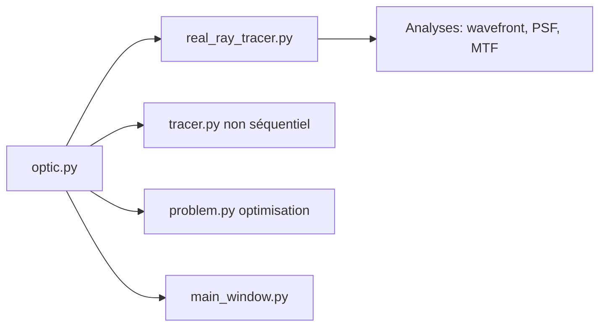

# HarrisonKramer/optiland

> Plateforme Python de conception optique, différentiable via PyTorch, pour ingénieurs et chercheurs en optique.

## Le problème
Concevoir et optimiser des systèmes de lentilles passe par des logiciels fermés, peu scriptables et sans gradients.

## Ce que ça fait vraiment
Construction de systèmes réfractifs et réflectifs, tracé de rayons, analyses (PSF/MTF, front d'onde, Zernike), optimisation par fonctions de mérite, tolérancement Monte Carlo. Deux moteurs : NumPy (CPU) et PyTorch (GPU, autograd). Import/export Zemax, CODE V et OSLO, visualisation Matplotlib et VTK, GUI en option. Le tracé non séquentiel est en pré-version.

## Comment c'est branché


## Essayer
```bash
pip install optiland
pip install optiland[gui]
pip install optiland[torch]
```
```python
from optiland.optic import Optic
lens = Optic()
```

## Coût et pièges
Gratuit. Le GPU demande d'installer soi-même un build CUDA de PyTorch. Le README précise que le code évolue en continu.

## Ce que ce n'est pas
Pas un outil de machine learning : le ML n'y sert qu'à différencier la physique. Les modules non séquentiel et multi-séquence sont marqués pre-release et beta.

## Alternatives
Aucune alternative open source nommée dans le README.

## Pour toi
À ignorer sauf si tu fais de l'optique : hors du champ data/IA usuel, même si l'angle simulation différentiable est original.
