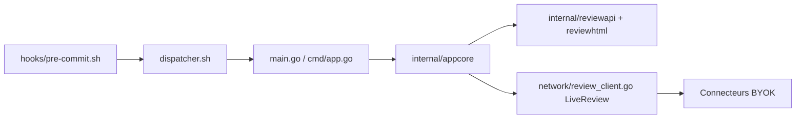

# HexmosTech/git-lrc

> Hook git qui lance une revue de code par IA sur chaque commit, pour les développeurs qui utilisent des agents.

## Le problème
Les agents de code retirent de la logique, relâchent des contraintes ou fuient des identifiants sans le dire ; on le découvre après le commit.

## Ce que ça fait vraiment
Le binaire `lrc` s'installe en hook global et, avant chaque commit, envoie le diff indexé à un service de revue, puis ouvre une interface locale : diff, commentaires par ligne, navigateur de problèmes filtré par gravité, résumé en diapositives. Les décisions (revue, `--vouch`, `--skip`, `--agent-mode` en JSON) sont inscrites dans le message de commit. Règles de dépôt dans `.lrc/`, connecteurs BYOK (OpenAI, Claude, DeepSeek, OpenRouter) et score de risque local.

## Comment c'est branché


## Essayer
```bash
curl -fsSL https://hexmos.com/lrc-install.sh | bash
git lrc setup
git add .
git lrc review
git lrc review --agent-mode
```

## Coût et pièges
Gratuit jusqu'à 30 000 lignes par mois ; Premium à partir de 32 $ pour 100 000 lignes. Il faut un compte Hexmos et une clé Gemini gratuite, ou ses propres clés. Seul le diff indexé est envoyé. L'installation passe par `curl | bash`.

## Ce que ce n'est pas
Pas une revue déterministe : un modèle peut se tromper. Le service de coordination LiveReview est hébergé chez l'éditeur ; le mode auto-hébergé est réservé à l'offre entreprise. Licence non identifiée par GitHub.

## Alternatives
LiveReview, la version d'équipe du même éditeur.

## Pour toi
À surveiller : pratique pour relire du code généré par IA avant commit, mais dépend d'un service tiers et sa licence est à clarifier.
