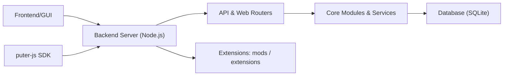

# HeyPuter/puter

> « Ordinateur internet » open source et auto-hébergeable : bureau web, applications et services pour développeurs.

## Le problème
Regrouper ses applications et fichiers dans un espace web unique, ou héberger applis et jeux web avec stockage et base, sans assembler chaque service.

## Ce que ça fait vraiment
Puter fournit un bureau dans le navigateur (bloc-notes, tableur, caméra…) et une plateforme de publication : cloud de fichiers, base de données, workers, IA, App Store pour monétiser. D'après l'architecture : backend Node.js avec routeurs, services et SQLite, interface `src/gui`, puter-js, terminal, émulateur, extensions, Docker. Disponible aussi en service hébergé sur puter.com.

## Comment c'est branché


## Essayer
```bash
git clone https://github.com/HeyPuter/puter
cd puter
npm install
npm start
curl -fsSL https://puter.com/selfhost | sh
```

## Coût et pièges
Gratuit en auto-hébergement, ouvert sur `puter.localhost:4100`. `curl | sh` exécute un script distant : à lire d'abord. AGPL-3.0 : exposer une version modifiée en réseau impose de publier son code.

## Ce que ce n'est pas
Pas un environnement de développement data/IA ni un système d'exploitation : une appli web qui imite un bureau.

## Alternatives
- Aucune alternative nommée dans le README.

## Pour toi
Ignorer : c'est un bureau web généraliste sous AGPL qui n'apporte rien de précis à un flux data/IA/MLOps.

