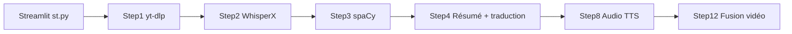

# Huanshere/VideoLingo

> Pipeline Streamlit de sous-titrage, traduction et doublage de vidéos, à partir de YouTube ou de fichiers.

## Le problème
Produire des sous-titres bien découpés et traduits de façon cohérente, puis un doublage, demande d'assembler plusieurs outils.

## Ce que ça fait vraiment
Étapes séquencées : téléchargement (yt-dlp), transcription au niveau du mot (WhisperX), segmentation NLP (spaCy), résumé et terminologie, traduction avec réflexion puis réécriture via un LLM compatible OpenAI, génération de sous-titres, puis doublage (GPT-SoVITS, Azure, OpenAI, Fish TTS, Edge, F5-TTS). Journalisation avec reprise. Limites listées par le README : bruit, langues mélangées, pas de voix distincte par locuteur.

## Comment c'est branché


## Essayer
```bash
git clone https://github.com/Huanshere/VideoLingo.git
cd VideoLingo
uv run --no-project --python 3.13 setup_env.py
.venv/bin/streamlit run st.py
docker build -t videolingo .
```

## Coût et pièges
FFmpeg 7 en bibliothèques partagées exigé. GPU NVIDIA conseillé. Il faut une URL, une clé et un modèle LLM compatible OpenAI capable de renvoyer du JSON structuré : facture à ta charge.

## Ce que ce n'est pas
Ce n'est pas un service hébergé : tout se lance chez toi. Ce n'est pas une garantie de traduction parfaite.

## Alternatives
Le README ne cite pas d'autre projet.

## Pour toi
À surveiller : bon exemple de pipeline ASR + LLM + TTS avec reprise, à lire pour ses choix de découpage plus qu'à déployer tel quel.

