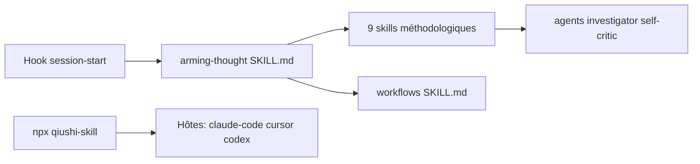

# HughYau/qiushi-skill

> Collection de skills d'agent qui imposent une méthode de raisonnement tirée de textes maoïstes, pour Claude Code et consorts.

## Le problème
Un agent conclut vite sans enquête, ne se relit pas et abandonne devant la difficulté ; l'auteur veut lui imposer une discipline de pensée.

## Ce que ça fait vraiment
Un noyau d'environ cinquante lignes s'injecte à chaque début de session (hook `session-start`), avec quatre règles : conclure selon les preuves, séparer faits, inférences et inconnues, ne déclarer fini que ce qui est vérifié, diagnostiquer avant de renoncer. Neuf skills se chargent à la demande (analyse des contradictions, enquête préalable, autocritique, concentration des forces…), avec commandes `/…`, deux sous-agents (`investigator`, `self-critic`) et des enchaînements (`workflows`). Les citations viennent des œuvres choisies de Mao ; le README est en chinois.

## Comment c'est branché


## Essayer
```bash
npx qiushi-skill
npx qiushi-skill install --target claude-code --scope user
npx qiushi-skill validate
```

## Coût et pièges
Gratuit ; l'installation écrit dans les dossiers de skills de chaque hôte. Le noyau injecté consomme du contexte à chaque session. Aucune évaluation chiffrée de l'effet n'est fournie.

## Ce que ce n'est pas
Pas un outil technique : ce sont des consignes en texte. L'auteur affirme que ce n'est ni de la propagande ni une « distillation de personnalité » ; l'effet sur la qualité du code n'est pas démontré.

## Alternatives
`obra/superpowers`, cité comme source d'inspiration : cadre de skills orienté développement logiciel.

## Pour toi
À ignorer : aucun gain mesuré, contexte consommé à chaque session, et cadre idéologique sans rapport avec ton métier ; `superpowers` est plus proche de ton usage.
