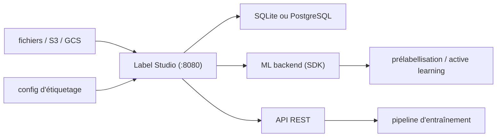

# HumanSignal/label-studio

> Outil d'annotation multi-types (image, texte, audio, vidéo, séries temporelles) auto-hébergeable.

## Le problème
Annoter sans outil dédié veut dire tableurs, fichiers éparpillés et aucune trace de qui a annoté quoi.
Réannoter après un changement de schéma d'étiquettes revient à tout refaire.

## Ce que ça fait vraiment
Interface d'annotation configurable par un langage de configuration dédié, avec gabarits prêts pour les cas courants.
Multi-utilisateurs et multi-projets : chaque annotation est rattachée à un compte.
Import depuis fichiers ou stockage cloud (S3, GCS, JSON, CSV, TSV, RAR, ZIP) ; export vers plusieurs formats de modèles.
Connexion d'un backend ML : prélabellisation par les prédictions, apprentissage en ligne, apprentissage actif sur les exemples difficiles.

## Comment c'est branché


## Essayer
```bash
pip install label-studio
label-studio
docker pull heartexlabs/label-studio:latest
docker run -it -p 8080:8080 -v $(pwd)/mydata:/label-studio/data heartexlabs/label-studio:latest
docker-compose up
docker compose -f docker-compose.yml -f docker-compose.minio.yml up -d
```

## Coût et pièges
L'édition auto-hébergée est libre d'accès ; l'éditeur pousse une Starter Cloud avec essai gratuit et des éditions différenciées.
SQLite par défaut : le compose de production impose Nginx et PostgreSQL ; Windows exige des wheels précompilés.

## Ce que ce n'est pas
Ce n'est pas un annotateur automatique : le ML backend prélabellise, l'humain valide.
Ce n'est pas une offre unique : les fonctions varient selon l'édition, le README renvoie à une page de comparaison.
Ce n'est pas monolithique : front, data manager, converter et transformers sont des dépôts séparés.

## Alternatives
label-studio-converter : encoder les étiquettes au format de ta bibliothèque, sans passer par l'UI.
label-studio-transformers : la bibliothèque Transformers déjà câblée pour Label Studio.

## Pour toi
La référence pour constituer un jeu annoté propre ; à déployer en compose PostgreSQL dès que plusieurs personnes annotent.
