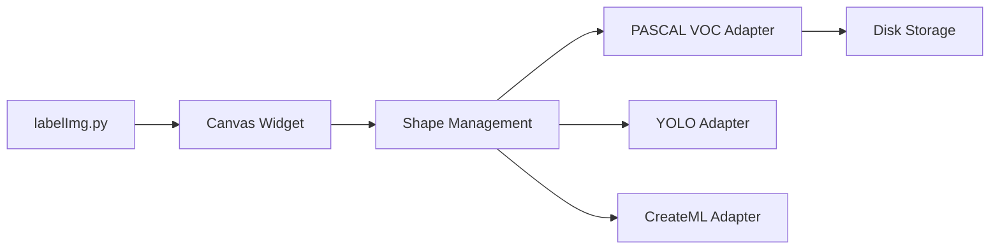

# HumanSignal/labelImg

> Outil graphique Qt d'annotation de boîtes englobantes, aujourd'hui archivé au profit de Label Studio.

## Le problème
Créer des jeux de données de détection d'objets demande de dessiner des boîtes sur les images et de les exporter au bon format.

## Ce que ça fait vraiment
Application de bureau Python/PyQt : on ouvre un dossier d'images, on trace des rectangles et on nomme les classes. Export PASCAL VOC (XML), YOLO (txt) ou CreateML. Une liste de classes prédéfinies se charge depuis `data/predefined_classes.txt`. L'auteur du README indique que le projet n'est plus développé et renvoie vers Label Studio.

## Comment c'est branché


## Essayer
```bash
pip3 install labelImg
labelImg
labelImg [IMAGE_PATH] [PRE-DEFINED CLASS FILE]
```

## Coût et pièges
Gratuit. Installation Qt/lxml parfois pénible (le README propose virtualenv, conda et Docker). En YOLO, le drapeau « difficult » est perdu et la liste de classes ne doit pas changer en cours de session.

## Ce que ce n'est pas
Ce n'est plus maintenu (451 issues ouvertes, dernier push en 2024-06). Il ne gère que des images et des boîtes, pas de texte, audio ni vidéo.

## Alternatives
- Label Studio : successeur cité dans le README, multi-modal (images, texte, hypertexte, audio, vidéo, séries temporelles).

## Pour toi
Ignorer pour un nouveau projet : archivé et remplacé par Label Studio ; à ne garder que pour un besoin ponctuel de boîtes YOLO en local.

