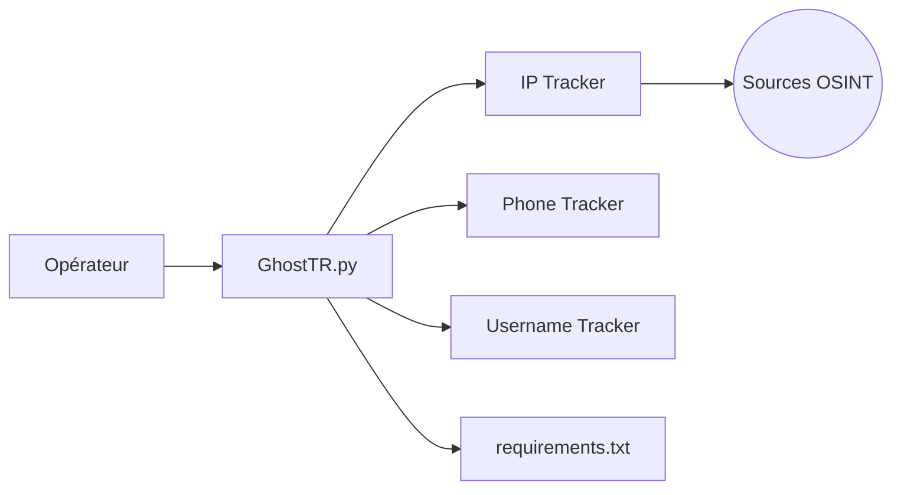

# HunxByts/GhostTrack

> Script Python interactif de recherche d'informations sur une adresse IP, un numéro de téléphone ou un pseudonyme.

## Le problème
Les recherches ouvertes (OSINT) sur une IP, un numéro ou un pseudo se font à la main, source par source. L'outil rassemble ces trois recherches dans un menu unique.

## Ce que ça fait vraiment
- Un seul script, `GhostTR.py`, avec un menu : IP Tracker, Phone Tracker, Username Tracker.
- Il interroge des sources publiques depuis la machine de l'utilisateur et affiche le résultat dans le terminal.
- Le README cite l'outil tiers Seeker comme moyen d'obtenir une IP en amont. Les sources interrogées ne sont pas nommées.
- Usage manuel et interactif uniquement, sans base ni serveur.

## Comment c'est branché


## Essayer
```bash
git clone https://github.com/HunxByts/GhostTrack.git
cd GhostTrack
pip3 install -r requirements.txt
python3 GhostTR.py
```

## Coût et pièges
Gratuit, Python 3 et dépendances du `requirements.txt`. Aucune licence déclarée : réutilisation juridiquement incertaine. Rechercher des informations sur une personne identifiable relève des règles de protection des données (RGPD notamment) : une base légale est nécessaire.

## Ce que ce n'est pas
Ni un outil de géolocalisation fiable garanti, ni un produit maintenu : dernier commit en janvier 2024, sans documentation des sources ni des limites.

## Alternatives
- seeker (thewhiteh4t/seeker) : cité dans le README comme outil amont pour obtenir une IP.

## Pour toi
Sans licence, sans maintenance et avec un usage centré sur des personnes, il n'apporte rien à un flux data/IA/MLOps : à ignorer.

