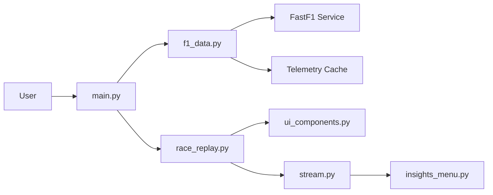

# IAmTomShaw/f1-race-replay

> Application Python qui rejoue une course de Formule 1 à partir de la télémétrie FastF1.

## Le problème
Les données de télémétrie F1 publiques sont brutes ; sans outil, impossible de visualiser positions, pneus et safety car tour par tour.

## Ce que ça fait vraiment
Charge une session (course, sprint, qualifications) via FastF1, la met en cache puis la rend avec Arcade : piste, classement, pneus, DRS.
Contrôles de lecture (pause, retour, vitesse 0,5x à 4x), sélection de pilotes pour voir vitesse et rapport engagé.
Safety car simulée à ~500 m devant le leader, faute de GPS réel.
Un flux de télémétrie alimente des fenêtres « Insights » personnalisables (classe `PitWallWindow`).

## Comment c'est branché


## Essayer
```bash
git clone https://github.com/IAmTomShaw/f1-race-replay
cd f1-race-replay
pip install -r requirements.txt
python main.py
python main.py --viewer --year 2025 --round 12
```

## Coût et pièges
Gratuit ; premier chargement d'une session long (téléchargement + calcul). OpenGL 3.3+ requis ; souci connu sous conda.

## Ce que ce n'est pas
Pas un outil d'analyse exact : le classement est faux dans les premiers virages et aux arrêts au stand. Aucune licence déclarée, usage déclaré non commercial.

## Alternatives
Aucune alternative nommée dans le README.

## Pour toi
À ignorer côté pro : projet ludique sans licence, utile au plus comme exemple d'usage de FastF1 pour un side-project data sport.
