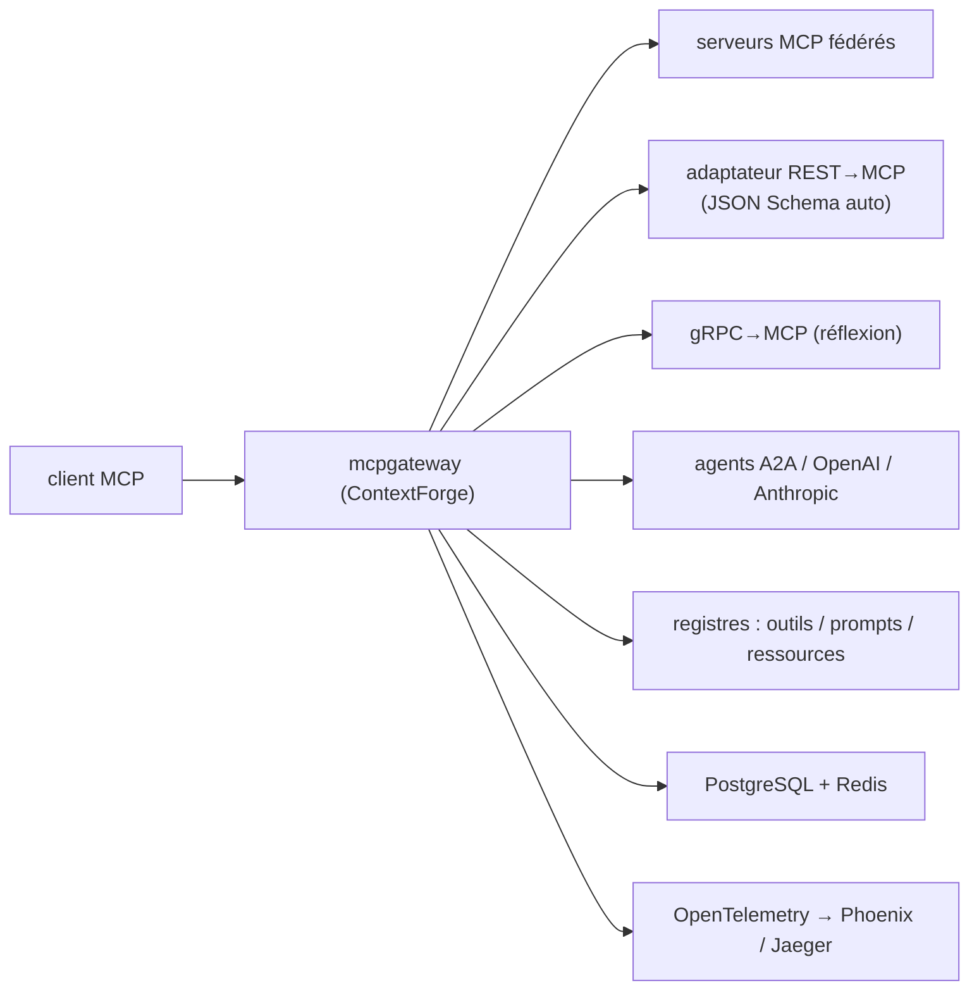

# IBM/mcp-context-forge

> Registre et proxy qui fédère serveurs MCP, agents A2A et APIs REST/gRPC derrière un endpoint.

## Le problème
Dix serveurs MCP, trois APIs REST et deux agents externes veulent dire dix jeux d'authentification,
aucun catalogue commun, aucune limite de débit et aucune trace unifiée de qui appelle quoi.

## Ce que ça fait vraiment
Fédère MCP, A2A et REST/gRPC en un endpoint unique, avec gouvernance, découverte et observabilité
centralisées. Il enrobe les services non-MCP en serveurs MCP virtuels, extrait automatiquement le
JSON Schema des APIs REST, et traduit gRPC vers MCP par le protocole de réflexion avec découverte et
introspection automatiques des méthodes. Trois registres unifiés : prompts (templates Jinja2,
multimodal, versionnage et rollback), ressources (accès par URI, détection MIME, cache, mises à jour
SSE), outils (validation d'entrée, contrôle de concurrence). Transports HTTP, JSON-RPC, WebSocket,
SSE et HTTP streamable, plus stdio côté serveur. Une Admin UI en HTMX/Alpine.js gère la
configuration et les logs en temps réel, y compris en déploiement coupé du réseau. Traçage
OpenTelemetry vers Phoenix, Jaeger, Zipkin, Tempo, DataDog, New Relic, avec métriques de jetons et
de coûts. Tourne lui-même comme serveur MCP conforme, et passe à l'échelle multi-cluster avec Redis.

## Comment c'est branché


## Essayer
```bash
python3 -m mcpgateway.scripts.init_secrets
uvx --from mcp-contextforge-gateway mcpgateway --host 0.0.0.0 --port 4444
pip install mcp-contextforge-gateway
python3 -m mcpgateway.scripts.init_secrets --patch-env .env
export MCPGATEWAY_BEARER_TOKEN=$(python3 -m mcpgateway.utils.create_jwt_token --username admin@example.com --exp 10080 --secret "$JWT_SECRET_KEY")
python3 -m mcpgateway.translate --stdio "uvx mcp-server-git" --expose-sse --expose-streamable-http --port 9000
docker pull ghcr.io/ibm/mcp-context-forge:latest
docker compose up -d
make venv install-dev && make serve
npx -y @modelcontextprotocol/inspector
```

## Coût et pièges
Gratuit. `JWT_SECRET_KEY` et `AUTH_ENCRYPTION_SECRET` sont obligatoires **partout**, y compris en
local : sans eux la passerelle refuse de démarrer, et toute variable `.env` manquante provoque un
échec immédiat par validation Pydantic. `docker compose up -d` ne construit pas l'image localement —
un build local échoue sur la résolution de `cryptography`, il faut tirer l'image GHCR. arm64 n'est
pas supporté en production. Helm force `SSRF_ALLOW_PRIVATE_NETWORKS=false` : enregistrer des URLs
internes demande d'ouvrir explicitement les CIDR du cluster.

## Ce que ce n'est pas
Pas un serveur MCP métier : il n'apporte aucun outil propre, il fédère ceux des autres. Pas léger :
PostgreSQL avec 55+ tables, Redis, nginx, pgAdmin dans la stack Compose. Pas figé : la version citée
est une `1.0.0-RC-3`, avec un guide de migration et une page de dépréciations. Le README est tronqué
avant la fin de la configuration.

## Alternatives
Aucune alternative nommée : le README ne cite que MCP Inspector et des backends de traçage.

## Pour toi
La bonne réponse au jour où tu auras dix serveurs MCP à gouverner ; surdimensionné avant ça.
