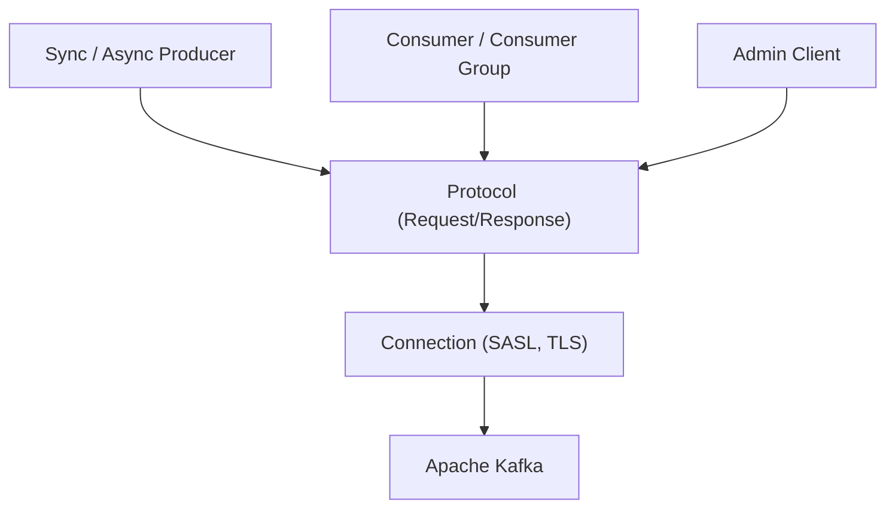

# IBM/sarama

> Client Go pour Apache Kafka : producteurs, consommateurs, groupes et administration.

## Le problème
Parler à Kafka depuis Go demande d'implémenter le protocole, la sécurité et la gestion des courtiers.

## Ce que ça fait vraiment
Fournit producteur synchrone et asynchrone, consommateur, groupes de consommateurs et client d'administration. La couche protocole gère encodage, transactions et versions ; la connexion gère courtiers, SASL et TLS. Un sous-paquet `mocks` aide aux tests, et le dossier `tools` contient des outils en ligne de commande.

## Comment c'est branché

## Essayer
Aucune commande dans le README ; documentation sur pkg.go.dev et dossier `examples`.

## Coût et pièges
Gratuit. Garantie « 2 releases + 2 mois » : seules les deux dernières versions de Kafka et de Go sont supportées.

## Ce que ce n'est pas
Pas un serveur Kafka ni un outil de streaming : c'est uniquement un client Go.

## Alternatives
Aucune alternative nommée dans le README.

## Pour toi
Adopter si tes pipelines de données ou d'inférence sont en Go et parlent à Kafka ; inutile sinon.

