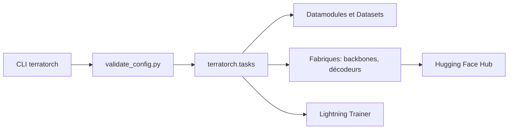

# IBM/terratorch

> Bibliothèque PyTorch pour affiner des modèles de fondation géospatiaux, destinée aux équipes d'observation de la Terre.

## Le problème
Affiner un modèle de fondation sur des images satellites oblige à recoller à la main backbones, décodeurs, datasets et boucle d'entraînement.

## Ce que ça fait vraiment
Des tâches Lightning (segmentation, classification, régression par pixel) pilotées par fichier YAML, CLI ou notebook. Des fabriques assemblent un backbone (Prithvi, TerraMind, SatMAE, Clay…) et un décodeur (SMP, mmsegmentation). Les datamodules TorchGeo et GEO-Bench sont fournis. Aucun modèle n'est hébergé : les poids viennent du Hugging Face Hub.

## Comment c'est branché


## Essayer
```bash
pip install terratorch
conda install -c conda-forge gdal
pip install terratorch[peft]
```

## Coût et pièges
GDAL est obligatoire et son installation est décrite comme complexe (conda conseillé). Des extras (vllm, mmseg, wxc en Python ≥ 3.11) s'installent à part. L'opérateur doit vérifier lui-même la licence de chaque modèle téléchargé.

## Ce que ce n'est pas
Ce n'est pas un catalogue de modèles : le README l'écrit noir sur blanc. Ce n'est pas généraliste : tout est pensé pour le géospatial. Licence du dépôt non déclarée dans le catalogue.

## Alternatives
- TorchGeo : la bibliothèque de base, si tu n'as besoin que des datasets et modèles sans la couche de fine-tuning.
- Iterate : l'outil HPO/NAS cité par le README, pour la recherche d'hyperparamètres.

## Pour toi
À surveiller : très utile si tu fais de l'imagerie satellite, mais hors du quotidien d'un profil data/IA généraliste et licence non déclarée.
